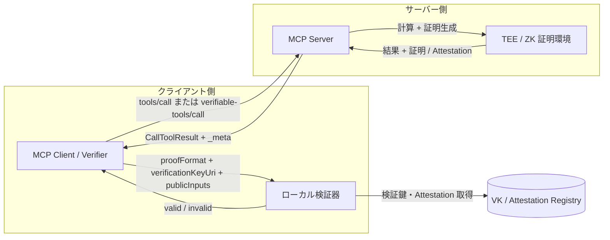
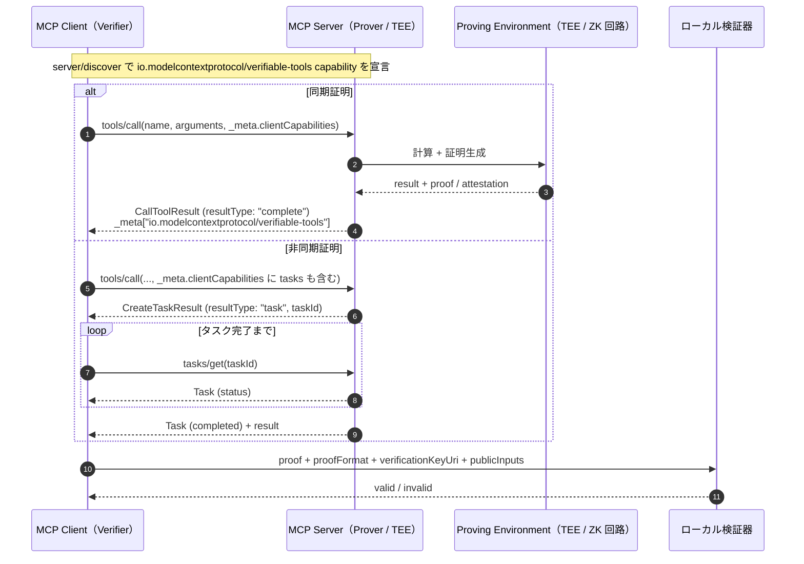
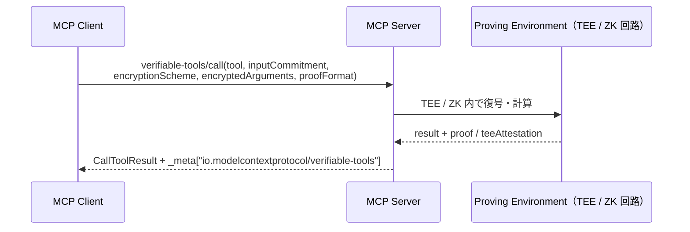

# MCP 拡張仕様案（日本語版）：検証可能なツール実行結果

> 注：本稿は `MCP_zk_verifiable_extension.md` の日本語訳・解説版です。MCP リポジトリへの提出用は英語版 SEP 形式を使用してください。

## 1. 概要

本提案は、MCP においてツール実行結果に暗号学的な証拠（ゼロ知識証明、TEE Attestation など）を添付できるオプショナル拡張 `io.modelcontextprotocol/verifiable-tools` を定義するものです。

クライアントはサーバーを盲目的に信頼することなく、「指定された関数 `f` が、指定された入力 `X` に対して正しく実行され、結果 `Y` が改ざんされていない」ことをローカルで検証できます。

MCP `2026-07-28` で認可（OAuth 2.1 / RFC 9207）や無状態化が進んでも、「誰がアクセスできるか」は保証されても、「返ってきた値が正しいか」は保証されません。本拡張はそのギャップを埋めます。

### 1.1 概要図



## 2. 背景・動機

- MCP `2026-07-28` では、ステートレス化、`server/discover` による capability 宣言、 long-running work の `tasks` 拡張への移行などが行われた。
- しかし、これらはスケール、ルーティング、アクセス制御を解決するもので、ツール実行結果の完全性・正確性までは保証しない。
- AI エージェントが金融、医療、インフラ、ガバナンスシステムを動かす時代において、計算結果の検証可能性（Verifiability）は必須となる。
- zk-SNARKs / zk-STARKs（ezkl、risc0、snarkjs 等）や TEE（Intel SGX、AMD SEV、AWS Nitro 等）は実用的な性能に達しており、プロトコル層で標準化する自然なタイミングである。
- コア仕様に特定の暗号ライブラリを組み込むのではなく、**拡張（Extension）** として定義することで、必要な実装のみが対応できる。

## 3. 対象プロトコルバージョン

本拡張は **MCP `2026-07-28` 以降** を対象とする。

依存する仕様：

- リクエスト単位の `_meta` メタデータによるステートレス処理
- `server/discover` による capability 宣言
- `ClientCapabilities` / `ServerCapabilities` の `extensions` フィールド
- 非同期処理用の `io.modelcontextprotocol/tasks` 拡張
- すべての成功レスポンスに含まれる `resultType`
- Streamable HTTP 用の `Mcp-Method` / `Mcp-Name` ヘッダー

## 4. 拡張識別子

```text
io.modelcontextprotocol/verifiable-tools
```

サードパーティー実装の場合、自社が管理するベンダープレフィックスを使用すること。例：`com.example/verifiable-tools`。

## 5. Capability（能力宣言）

クライアント・サーバー双方が、`extensions` マップ内に本拡張識別子をキーとするオブジェクトを宣言する。

| フィールド | 型 | 説明 |
|---|---|---|
| `proofFormats` | `string[]` | 対応する証明形式。`"{engine}-{majorVersion}"` の形式。例：`"ezkl-v1"`、`"risc0-v1"`、`"snarkjs-v2"`、`"tee-sgx-v1"` |
| `blindExecution` | `boolean` | ブラインド／コミットメント入力によるツール実行に対応するか |
| `requireProof` | `boolean` | クライアント側：true の場合、サーバーは可能な限り証明を返す。サーバー側：証明不能な呼び出しを拒否しうる |

`server/discover` 応答例：

```json
{
  "jsonrpc": "2.0",
  "id": "discover-1",
  "result": {
    "resultType": "complete",
    "supportedVersions": ["2026-07-28"],
    "capabilities": {
      "tools": {},
      "extensions": {
        "io.modelcontextprotocol/verifiable-tools": {
          "proofFormats": ["ezkl-v1", "tee-sgx-v1"],
          "blindExecution": true
        },
        "io.modelcontextprotocol/tasks": {}
      }
    },
    "_meta": {
      "io.modelcontextprotocol/serverInfo": {
        "name": "example-verifiable-server",
        "version": "1.0.0"
      }
    }
  }
}
```

## 6. リクエストメタデータ

クライアントは各リクエストの `_meta` に `io.modelcontextprotocol/clientCapabilities`（その中に `extensions`）を含め、必要に応じて `io.modelcontextprotocol/verifiable-tools` キーでリクエスト固有のオプションを指定できる。

```json
{
  "jsonrpc": "2.0",
  "id": 1,
  "method": "tools/call",
  "params": {
    "name": "calculateRisk",
    "arguments": { "symbol": "AAPL" },
    "_meta": {
      "io.modelcontextprotocol/protocolVersion": "2026-07-28",
      "io.modelcontextprotocol/clientInfo": { "name": "trading-agent", "version": "1.0.0" },
      "io.modelcontextprotocol/clientCapabilities": {
        "extensions": {
          "io.modelcontextprotocol/verifiable-tools": {
            "proofFormats": ["ezkl-v1"],
            "requireProof": true
          },
          "io.modelcontextprotocol/tasks": {}
        }
      },
      "io.modelcontextprotocol/verifiable-tools": {
        "requestedProofFormat": "ezkl-v1"
      }
    }
  }
}
```

HTTP トランスポート使用時は以下のヘッダーが必要：

```http
MCP-Protocol-Version: 2026-07-28
Mcp-Method: tools/call
Mcp-Name: calculateRisk
```

## 7. 検証可能なツール結果

拡張がネゴシエートされ、サーバーが証明を生成できる場合、`tools/call` の結果の `_meta["io.modelcontextprotocol/verifiable-tools"]` に証明情報を含める。

```json
{
  "jsonrpc": "2.0",
  "id": 1,
  "result": {
    "resultType": "complete",
    "content": [
      { "type": "text", "text": "42" }
    ],
    "isError": false,
    "_meta": {
      "io.modelcontextprotocol/serverInfo": {
        "name": "example-verifiable-server",
        "version": "1.0.0"
      },
      "io.modelcontextprotocol/verifiable-tools": {
        "proof": "0x8f3a...",
        "proofFormat": "ezkl-v1",
        "circuitHash": "0x12ab...",
        "verificationKeyUri": "https://example.com/vk/0x12ab...",
        "publicInputs": ["42", "0xdeadbeef..."],
        "teeAttestation": "0x9c2f..."
      }
    }
  }
}
```

### 7.1 フィールド定義

| フィールド | 型 | 必須性 | 説明 |
|---|---|---|---|
| `proof` | `string` | 推奨 | ZKP または Attestation。hex / base64 エンコード。大きい場合は `proofUri` を使用 |
| `proofUri` | `string` (URI) | 任意 | 証明データが大きい場合の取得先 |
| `proofFormat` | `string` | 推奨 | 使用したエンジン・バージョン（`"ezkl-v1"` 等） |
| `circuitHash` | `string` | 推奨 | 実行した回路・プログラム・Docker イメージのハッシュ |
| `verificationKeyUri` | `string` (URI) | 任意 | 検証鍵（VK）の取得先 |
| `publicInputs` | `array` | 条件付き | 証明検証に必要な公開入力。TEE Attestation のみの場合は省略 |
| `teeAttestation` | `string` | 任意 | TEE 内で実行されたことを示す Attestation |
| `inputCommitment` | `string` | 任意 | 使用した入力へのコミットメント。クライアントが同一入力で証明されたことを確認するために使用 |

サーバーは capability で宣言した `proofFormat` のみを返す。クライアントも宣言した形式のみを検証する。

証明を生成できないが呼び出し自体は成功した場合、サーバーは通常の `resultType: "complete"` 応答を返し、`io.modelcontextprotocol/verifiable-tools` メタデータを省略してもよい。ただし `requireProof: true` を受け入れていた場合は呼び出しを拒否してもよい。

## 8. 非同期証明生成（Tasks 拡張の再利用）

ZKP の証明生成は数秒〜数分かかる。本拡張は独自の非同期プロトコルを作らず、MCP `2026-07-28` の公式拡張である `io.modelcontextprotocol/tasks` を再利用する。

`tools/call` がタスクを返す例：

```json
{
  "jsonrpc": "2.0",
  "id": 1,
  "result": {
    "resultType": "task",
    "taskId": "task-uuid-1234",
    "status": "working",
    "createdAt": "2026-08-11T06:00:00Z",
    "lastUpdatedAt": "2026-08-11T06:00:00Z",
    "ttlMs": 300000,
    "pollIntervalMs": 2000
  }
}
```

クライアントは `tasks/get` でポーリングする。タスクが `completed` になれば、`result` フィールドに通常の `CallToolResult` と `io.modelcontextprotocol/verifiable-tools` メタデータが含まれる。

```json
{
  "jsonrpc": "2.0",
  "id": 2,
  "method": "tasks/get",
  "params": {
    "taskId": "task-uuid-1234",
    "_meta": {
      "io.modelcontextprotocol/protocolVersion": "2026-07-28",
      "io.modelcontextprotocol/clientCapabilities": {
        "extensions": {
          "io.modelcontextprotocol/verifiable-tools": {},
          "io.modelcontextprotocol/tasks": {}
        }
      }
    }
  }
}
```

## 9. ブラインド・ツール実行

クライアントは平文引数を開示せずにツールを呼び出せる。本拡張は専用メソッドを定義する：

```text
verifiable-tools/call
```

### 9.1 パラメータ

| フィールド | 型 | 必須 | 説明 |
|---|---|---|---|
| `tool` | `string` | 必須 | 呼び出すツール名 |
| `inputCommitment` | `string` | 必須 | 平文入力へのコミットメント（ハッシュ） |
| `encryptionScheme` | `string` | 必須 | 暗号化・鍵共有方式の識別子（例：`"hpke-v1"`） |
| `encryptedArguments` | `string` | 必須 | 暗号化されたツール引数 |
| `proofFormat` | `string` | 任意 | 希望する証明形式 |

HTTP ヘッダー：

```http
MCP-Protocol-Version: 2026-07-28
Mcp-Method: verifiable-tools/call
```

`Mcp-Name` は `tools/call` / `resources/read` / `prompts/get` に限定される（SEP-2243）ため、本メソッドでは不要。

サーバーは TEE または ZK 回路内で復号・計算し、結果と証明を返す。平文引数は実行環境外にログやメモリとして残してはならない。

### 9.2 例

```json
{
  "jsonrpc": "2.0",
  "id": 3,
  "method": "verifiable-tools/call",
  "params": {
    "tool": "privateCreditCheck",
    "inputCommitment": "0xdeadbeef...",
    "encryptionScheme": "hpke-v1",
    "encryptedArguments": "0x0a1b...",
    "proofFormat": "tee-sgx-v1",
    "_meta": {
      "io.modelcontextprotocol/protocolVersion": "2026-07-28",
      "io.modelcontextprotocol/clientCapabilities": {
        "extensions": {
          "io.modelcontextprotocol/verifiable-tools": {
            "proofFormats": ["tee-sgx-v1"],
            "blindExecution": true
          }
        }
      }
    }
  }
}
```

応答例：

```json
{
  "jsonrpc": "2.0",
  "id": 3,
  "result": {
    "resultType": "complete",
    "content": [
      { "type": "text", "text": "approved" }
    ],
    "isError": false,
    "_meta": {
      "io.modelcontextprotocol/serverInfo": {
        "name": "private-credit-server",
        "version": "1.0.0"
      },
      "io.modelcontextprotocol/verifiable-tools": {
        "proof": "0x8f3a...",
        "proofFormat": "tee-sgx-v1",
        "inputCommitment": "0xdeadbeef...",
        "teeAttestation": "0x9c2f..."
      }
    }
  }
}
```

## 10. 検証フロー

### 10.1 通常ツール呼び出し



### 10.2 ブラインド・ツール呼び出し



証明検証に失敗した結果は、サーバーとの帯域外信頼関係がない限り、クライアントが後続処理に使用してはならない。

## 11. 設計根拠

### なぜ拡張なのか？

MCP の設計原則は「小さく安定したコア」と「拡張での実験」を重んじる。すべての MCP 実装に ZKP / TEE 検証ライブラリを強制すると、「Interoperability over optimization」「Stability over velocity」に反する。オプショナルな拡張として定義することで、必要な実装だけが対応でき、他は影響を受けない。

### なぜ非同期証明生成は Tasks 拡張を再利用するのか？

MCP `2026-07-28` で公式の長時間タスクモデルが確立した。本拡張が独自の非同期ライフサイクルを定義すると、エコシステムが断片化し、クライアントは 2 つのポーリングモデルを実装する必要が出る。Tasks を再利用することで、一貫した非同期処理が可能になる。

### なぜ証明情報を `_meta` に入れるのか？

ツール `content` は人間／モデルが読む出力を意図している。暗号学的証明は機械可読なアーティファクトであり、content に混ぜるとトークン化や表示で問題が生じる。`_meta` はプロトコルレベルのメタデータ用の標準拡張点であり、命名規則によって一つの明確なキーで予約できる。

### なぜ ZKP と TEE Attestation の両方をサポートするのか？

ワークロードによって最適な技術が異なる。ZKP はハードウェアベンダーへの信頼を不要にするが、生成コストが高い。TEE は高速で導入が容易だが、ハードウェア根付きの信頼仮定を伴う。両方をサポートすることで、単一の証明技術を強制せず、共通のトランスポート形式に収束できる。

## 12. 下位互換性

本拡張は **完全に下位互換** である。

- 未対応サーバー・クライアントは従来通りの `tools/call` を使用する。
- 拡張は双方が `extensions` capability マップに `io.modelcontextprotocol/verifiable-tools` を含めた場合のみ有効となる。
- `io.modelcontextprotocol/verifiable-tools` プレフィックスの `_meta` キーは、拡張を認識しない実装では無視される。
- 新しい `resultType` は導入しない。同期結果は `"complete"`、非同期は `io.modelcontextprotocol/tasks` 拡張の `"task"` を使用する。

## 13. セキュリティ考慮事項

- **検証鍵の配布**：証明の信頼性は検証鍵に依存する。`verificationKeyUri` は完全性保護されたチャネルで公開すべき。クライアントは `circuitHash` ごとに既知の良い鍵をピン留め・キャッシュすべき。
- **回路・プログラムの識別**：`circuitHash` は計算を一意に識別できなければならない。同一ハッシュが異なる実装に対応する可能性がある場合、完全性保証が弱まる。
- **証明形式のネゴシエーション**：クライアントとサーバーは宣言した `proofFormats` の共通部分のみを使用する。サーバーは未宣言の形式を返してはならず、クライアントも要求していない形式を受け入れてはならない。
- **ブラインド実行**：暗号化引数は証明環境内でのみ復号する。サーバーは平文入力をログに残したり、信頼できない下流システムに転送したりしてはならない。
- **サイドチャネル**：証明生成時間から入力に関する情報が漏洩しうる。サイドチャネル耐性が必要な場合、一定時間やパディングされた証明スケジュールを使用すべき。
- **可用性**：`requireProof: true` かつサーバーが証明できない場合、サーバーは呼び出しを拒否しうる。クライアントはこれを適切に処理すべき。

## 14. 参考実装

SEP が "Final" 状態になる前に参考実装が必要となる。想定されるプロトタイプ：

- MCP `2026-07-28` 対応サーバー：簡易な算術ツールに対して ezkl または risc0 証明を返す。
- クライアント検証器：`verificationKeyUri` から VK を取得し、`circuitHash` を確認して証明を検証する。
- `io.modelcontextprotocol/tasks` による非同期証明生成の統合。
- HPKE 暗号化引数を TEE 内で評価する `verifiable-tools/call` 例。

プロトタイプコード・CI 結果へのリンクは、実装が進んだ時点で追加する。

## 15. パフォーマンスへの影響

- 証明生成は元の計算より数桁遅くなることがある。そのため非同期生成がデフォルトのパターンである。
- 検証は通常ミリ秒〜秒単位で、クライアント側で実行可能。
- 大きな証明は `proofUri` または `verificationKeyUri` で外部取得し、`_meta` 内にインラインしないべき。

## 16. テスト計画

- サーバーが宣言した `proofFormats` のみを出力することを確認する適合テスト。
- 拡張未ネゴシエート時にクライアントが `io.modelcontextprotocol/verifiable-tools` メタデータを無視することのテスト。
- 非同期経路：`tools/call` がタスクを返し、`tasks/get` が検証可能な結果を解決するテスト。
- 否定的テスト：無効な証明、`circuitHash` の不一致、未知の `proofFormat`、不正なブラインド入力。

## 17. 検討した代替案

- **証明データをツール `content` の新しいコンテンツタイプとして入れる**：機械可読アーティファクトと人間向け出力を混在させ、レンダリングを複雑化するため却下。
- **「証明待ち」のための新しい同期 `resultType` を追加する**：公式の `io.modelcontextprotocol/tasks` 拡張を再利用する方がエコシステムの断片化を防ぐため却下。
- **すべての MCP サーバーに証明検証を義務付ける**：検証はクライアント側の責務であり、拡張は証明データのトランスポートのみを標準化するため却下。

## 18. 未解決事項

- `proofFormat` の値を MCP がレジストリとして管理すべきか、それとも capability 文字列による発見に委ねるべきか。
- `circuitHash` に Docker イメージダイジェストや Nix flake ハッシュなどの再現可能ビルド情報を含めるべきか。
- 検証鍵や TEE 署名鍵の失効をクライアントがどう扱うべきか。
- 本拡張を `resources/read` や `prompts/get` まで広げるべきか、`tools/call` に限定すべきか。
- 複数の ZKP ライブラリ間で相互運用性を最大化するための `publicInputs` の標準エンコーディングは何か。
