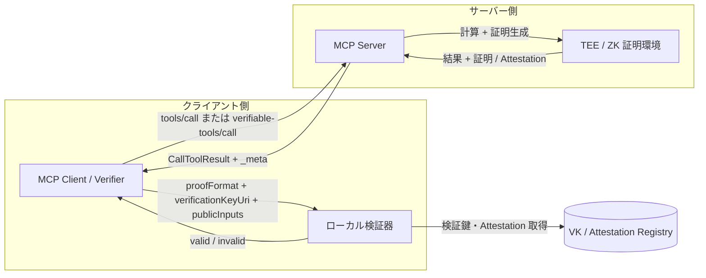
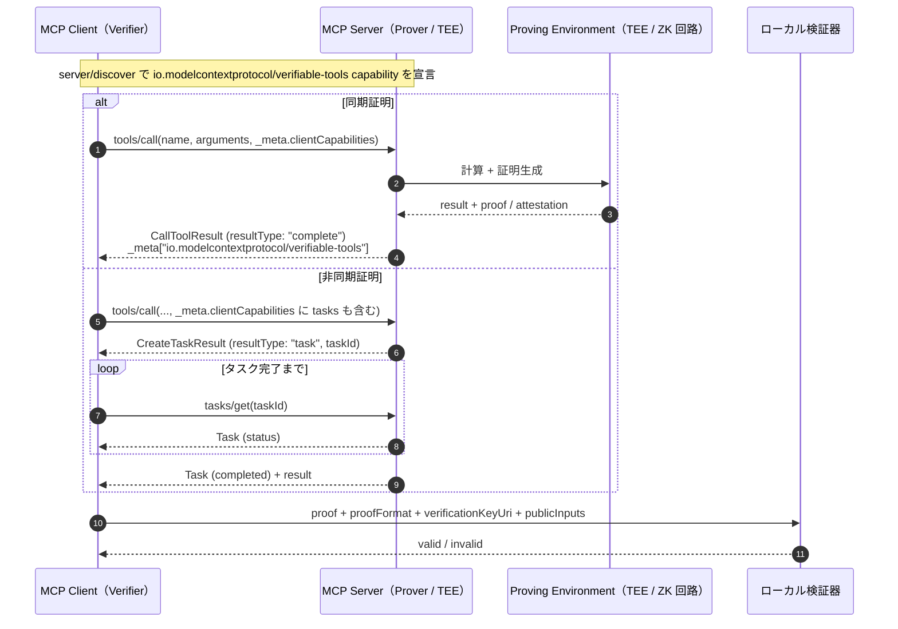
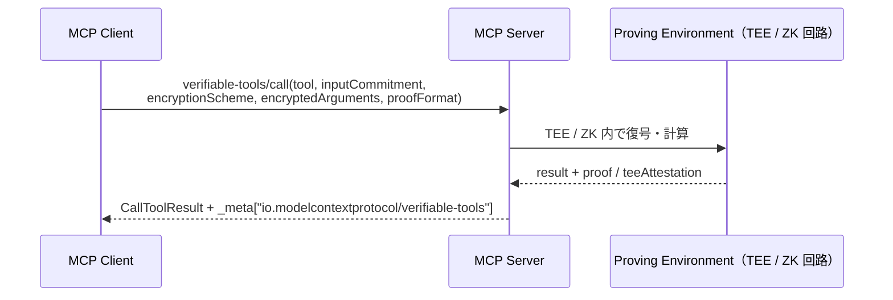

# MCP 拡張仕様案（日本語版）：検証可能なツール実行結果

> 注：本稿は `MCP_zk_verifiable_extension.md` の日本語訳・解説版です。MCP リポジトリへの提出用は英語版 SEP 形式を使用してください。

## 1. 概要

本提案は、MCP においてツール実行結果に暗号学的な証拠（ゼロ知識証明、TEE Attestation など）を添付できるオプショナル拡張 `io.modelcontextprotocol/verifiable-tools` を定義するものです。

クライアントはサーバーを盲目的に信頼することなく、「指定された関数 `f` が、指定された入力 `X` に対して正しく実行され、結果 `Y` が改ざんされていない」ことをローカルで検証できます。

MCP `2026-07-28` で認可（OAuth 2.1 / RFC 9207）や無状態化が進んでも、「誰がアクセスできるか」は保証されても、「返ってきた値が正しいか」は保証されません。本拡張はそのギャップを埋めます。

### 1.1 概要図



## 2. 背景・動機

- MCP `2026-07-28` では、ステートレス化、`server/discover` による capability 宣言、 long-running work の `tasks` 拡張への移行などが行われた。
- しかし、これらはスケール、ルーティング、アクセス制御を解決するもので、ツール実行結果の完全性・正確性までは保証しない。
- AI エージェントが金融、医療、インフラ、ガバナンスシステムを動かす時代において、計算結果の検証可能性（Verifiability）は必須となる。
- zk-SNARKs / zk-STARKs（ezkl、risc0、snarkjs 等）や TEE（Intel SGX、AMD SEV、AWS Nitro 等）は実用的な性能に達しており、プロトコル層で標準化する自然なタイミングである。
- コア仕様に特定の暗号ライブラリを組み込むのではなく、**拡張（Extension）** として定義することで、必要な実装のみが対応できる。

### 2.1 認可だけでは不十分な理由：信頼のギャップ

MCP `2026-07-28` は「このクライアントは、このサーバー上のこのツールを呼び出してよいか」という問いに答える。しかし、「返ってきた値は、ツールが計算すべきだった値か」という問いには何も答えない。現在、クライアントにある選択肢はサーバー運営者を信頼することだけである。MCP サーバーがクライアントを実行する人と同じ人によって起動されたローカルプロセスだった間は、それでも許容できた。次のような状況では許容できない。

- **サーバーが第三者である。** エージェントは、他者が運営するツール（市場データベンダー、信用情報機関、コンプライアンス審査サービス、別組織のエージェントなど）を呼び出すようになっている。認可が証明するのはクライアントのサーバーに対する身元であり、サーバーのクライアントに対する正しさではない。
- **身元を変えずにサーバーが侵害されうる。** サーバー依存関係へのサプライチェーン攻撃、悪意ある内部者、誤ってデプロイされたモデルのバージョンは、OAuth トークン、TLS 証明書、`server/discover` の出力をまったく変えないまま、ツールの返り値だけを密かに変えられる。認可では検知できないが、ピン留めした `circuitHash` なら検知できる。
- **結果が不可逆なアクションを引き起こす。** エージェントはツール結果に基づき、注文の発注、融資の承認、投薬、ファイアウォールポートの開放などを行う。「値が返った」ことと「その値に基づき実行した」ことの間に人間の確認段階がないため、値そのものが証拠を持たなければならない。
- **事後の説明責任が必要である。** 規制当局、監査人、取引相手は「どのプログラムが、どの入力に対してこの判断を生成したのか」と問う。署名付きログエントリが証明するのは誰かが何かが起きたと言ったことだが、証明は実際にそれが起きたことを示す。

以下のシナリオは、このギャップが具体化する場所を示す。いずれも参考実装が対象とするワークロードである（§14 参考実装）。

#### 2.2 シナリオ A〜F

**シナリオ A：エージェント間のツール市場**

オーケストレーションエージェントが、監査したことのない専門 MCP サーバー（価格計算エンジン、法律条項分類器、地理空間ルーティングツールなど）から結果を購入し、呼び出しごとに支払う。検証可能性がなければ、購入者は正しい結果と、安価な近似値、古いキャッシュ結果、捏造された結果を区別できない。宣伝されたプログラムに `circuitHash` を固定し、支払対象のすべての結果に証明を添付すれば、市場は「検証済み結果に対して支払う」形にできる。購入者はローカルで検証してから支払いを解放する。このパターンにより、中央の評価機関なしにツールサーバーをコモディティ化できる。

**シナリオ B：トレーディングおよび財務エージェント**

トレーディングエージェントがベンダーのサーバーで `riskScore(symbol)` を呼び出し、その答えからポジションサイズを決める。侵害されたベンダー（または企業プロキシで TLS が終端された後の中間者）が操作したスコアを返しても、正直なベンダーと区別できない。ピン留めしたモデルがコミット済み入力に対して `riskScore` を評価したことを示す証明と、価格フィードが指定された取引所のものであることを示す入力 provenance Attestation（§7.4 入力 provenance）を組み合わせれば、エージェントは行動する根拠を得られる。遅延／サンプリング証明（§8.1 遅延証明）により、高頻度の呼び出し側は毎回証明の費用を負担する代わりにランダムな一部を検証できる。

**シナリオ C：プライベートデータに対する規制対象の判断**

銀行のエージェントがスコアリングサービスで `privateCreditCheck` を呼び出す。申請者のデータを計算に必要な範囲を超えてサービス運営者に開示してはならない一方、規制当局は後から、差別的な亜種ではなく*承認済み*のスコアリングモデルが使われたことを確認できなければならないという、2 つの義務が衝突する。ブラインド実行（§9 ブラインド・ツール実行）は前者を扱い、モデルの `circuitHash` に束縛された証明は後者を扱う。監査成果物になるのはログエントリではなく証明である。

**シナリオ D：医療・安全システムにおける認証済みモデル推論**

臨床意思決定エージェントまたは産業制御エージェントが、認証済み ML モデル（`ezkl` 方式の推論証明、またはモデルコンテナの TEE Attestation）を実行するツールを呼び出す。「認証済みバージョンが使われたか」は認可では答えられない。`circuitHash` が正確なモデル成果物を識別し、証明が返された推論がその成果物から得られたことを示す。

**シナリオ E：多段エージェントチェーンと委任ツール利用**

エージェント A がエージェント B に結果を求め、B がサーバー C から取得する。A が目にするのは常に B だけである。証明は `_meta` 内の自己完結した成果物なので、B は C の証明を変更せず転送でき、A は B を信頼せずに C の `circuitHash` と検証鍵で検証できる。検証可能性はチェーンに沿って合成できるが、認可はできない。

**シナリオ F：自律的なセキュリティ対応**

システムを監視するエージェントが、「この状態は悪用可能」と判定するツールに基づき、高価または破壊的なアクション（コントラクトの停止、ホストの隔離）を発動しようとする。観測された状態に対して、監査済みプログラムが悪用可能性述語を評価したことを示す証明（悪用入力は非公開にした *proof-of-exploit*）があれば、受信側システムは自動的に行動しつつ、攻撃者が再送または偽装できるものを残さずに済む。

#### 2.3 本拡張が保証すること／保証しないこと

| 性質 | 保証するもの | 注記 |
|---|---|---|
| ピン留めされた `f`（`circuitHash`）とコミット済み `X`（`inputCommitment`）についての `Y = f(X)` | ZK 証明または TEE Attestation | 中核となる保証。 |
| 返された `content` が証明された `Y` であること | `publicInputs` 内の `outputCommitment` | §7.2 結果の束縛を参照。 |
| 証明が*この*リクエストへの回答であり、再送でないこと | `publicInputs` 内の `nonce` | §7.2 結果の束縛を参照。 |
| `X` の平文がサーバーから隠されること | ブラインド実行 | `verifiable-tools/call` の場合のみ。FHE を使わない限り、サーバーの証明環境は `X` を見る。 |
| `X` 自体が真であること（実在する価格、実在する記録など） | **本拡張単独では保証しない** | 入力 provenance（§7.4）が必要。zkTLS、オラクル Attestation、署名付きデータなど。 |
| `f` が*正しい*関数であること（良いモデル、正しいアルゴリズム） | **保証しない** | 範囲外。`circuitHash` は `f` を識別するが、その妥当性を判断しない。 |
| サーバーが必ず応答すること（liveness） | **保証しない** | `requireProof` により拒否される場合がある。 |

## 3. 対象プロトコルバージョン

本拡張は **MCP `2026-07-28` 以降** を対象とする。

依存する仕様：

- リクエスト単位の `_meta` メタデータによるステートレス処理
- `server/discover` による capability 宣言
- `ClientCapabilities` / `ServerCapabilities` の `extensions` フィールド
- 非同期処理用の `io.modelcontextprotocol/tasks` 拡張
- すべての成功レスポンスに含まれる `resultType`
- Streamable HTTP 用の `Mcp-Method` / `Mcp-Name` ヘッダー

## 4. 拡張識別子

```text
io.modelcontextprotocol/verifiable-tools
```

サードパーティー実装の場合、自社が管理するベンダープレフィックスを使用すること。例：`com.example/verifiable-tools`。

## 5. Capability（能力宣言）

クライアント・サーバー双方が、`extensions` マップ内に本拡張識別子をキーとするオブジェクトを宣言する。

| フィールド | 型 | 説明 |
|---|---|---|
| `proofFormats` | `string[]` | 対応する証明形式。`"{engine}-{majorVersion}"` の形式。例：`"ezkl-v1"`、`"risc0-v1"`、`"snarkjs-v2"`、`"tee-sgx-v1"` |
| `blindExecution` | `boolean` | ブラインド／コミットメント入力によるツール実行に対応するか |
| `requireProof` | `boolean` | クライアント側：true の場合、サーバーは可能な限り証明を返す。サーバー側：証明不能な呼び出しを拒否しうる |
| `requireInputProvenance` | `boolean` | クライアント側：true の場合、外部データを消費する結果は `inputAttestations`（§7.4 入力 provenance）を必ず含む |
| `blindEncryptionSchemes` | `string[]` | サーバー側：`verifiable-tools/call` が受け付ける `encryptionScheme` の値。例：`["hpke-v1"]`。サーバーで `blindExecution: true` の場合は必須 |
| `blindPublicKey` | `string` | サーバー側：最初に列挙された方式の base64url 公開鍵。どのように Attestation で束縛またはピン留めするかは §9 を参照。サーバーで `blindExecution: true` の場合は必須 |
| `resultTtlMs` | `number` | サーバー側：`resultId` が `verifiable-tools/prove` によって証明可能な期間。サーバーが `resultId` を返す可能性がある場合は必須であり、クライアントは `resultTtlMs` を広告していないサーバーからの `resultId` を証明不能として扱わなければならない |

`server/discover` 応答例：

```json
{
  "jsonrpc": "2.0",
  "id": "discover-1",
  "result": {
    "resultType": "complete",
    "supportedVersions": ["2026-07-28"],
    "capabilities": {
      "tools": {},
      "extensions": {
        "io.modelcontextprotocol/verifiable-tools": {
          "proofFormats": ["ezkl-v1", "tee-sgx-v1"],
          "blindExecution": true
        },
        "io.modelcontextprotocol/tasks": {}
      }
    },
    "_meta": {
      "io.modelcontextprotocol/serverInfo": {
        "name": "example-verifiable-server",
        "version": "1.0.0"
      }
    }
  }
}
```

## 6. リクエストメタデータ

クライアントは各リクエストの `_meta` に `io.modelcontextprotocol/clientCapabilities`（その中に `extensions`）を含め、必要に応じて `io.modelcontextprotocol/verifiable-tools` キーでリクエスト固有のオプションを指定できる。

```json
{
  "jsonrpc": "2.0",
  "id": 1,
  "method": "tools/call",
  "params": {
    "name": "calculateRisk",
    "arguments": { "symbol": "AAPL" },
    "_meta": {
      "io.modelcontextprotocol/protocolVersion": "2026-07-28",
      "io.modelcontextprotocol/clientInfo": { "name": "trading-agent", "version": "1.0.0" },
      "io.modelcontextprotocol/clientCapabilities": {
        "extensions": {
          "io.modelcontextprotocol/verifiable-tools": {
            "proofFormats": ["ezkl-v1"],
            "requireProof": true
          },
          "io.modelcontextprotocol/tasks": {}
        }
      },
      "io.modelcontextprotocol/verifiable-tools": {
        "requestedProofFormat": "ezkl-v1",
        "nonce": "0x5f1c..."
      }
    }
  }
}
```

| リクエストオプション | 型 | 説明 |
|---|---|---|
| `requestedProofFormat` | `string` | ネゴシエートされた共通集合から選ぶ優先形式 |
| `nonce` | `string` | `0x` プレフィックス付きの小文字 hex で、16〜64 バイトをエンコードするもの（`^0x[0-9a-f]{32,128}$`）。サーバーは証明に束縛して返さなければならない。§7.2 結果の束縛を参照 |
| `replyPublicKey` | `string` | ブラインド呼び出し用。ツール出力も機密にする必要がある場合に、サーバーが `content` を暗号化する先のクライアント鍵 |

HTTP トランスポート使用時は以下のヘッダーが必要：

```http
MCP-Protocol-Version: 2026-07-28
Mcp-Method: tools/call
Mcp-Name: calculateRisk
```

## 7. 検証可能なツール結果

拡張がネゴシエートされ、サーバーが証明を生成できる場合、`tools/call` の結果の `_meta["io.modelcontextprotocol/verifiable-tools"]` に証明情報を含める。

```json
{
  "jsonrpc": "2.0",
  "id": 1,
  "result": {
    "resultType": "complete",
    "content": [
      { "type": "text", "text": "42" }
    ],
    "isError": false,
    "_meta": {
      "io.modelcontextprotocol/serverInfo": {
        "name": "example-verifiable-server",
        "version": "1.0.0"
      },
      "io.modelcontextprotocol/verifiable-tools": {
        "proof": "0x8f3a...",
        "proofFormat": "ezkl-v1",
        "circuitHash": "0x12ab...",
        "verificationKeyUri": "https://example.com/vk/0x12ab...",
        "publicInputs": ["0x3b7e...", "0xdeadbeef...", "0x5f1c..."],
        "outputCommitment": "0x3b7e...",
        "inputCommitment": "0xdeadbeef...",
        "nonce": "0x5f1c...",
        "teeAttestation": "0x9c2f..."
      }
    }
  }
}
```

### 7.1 フィールド定義

| フィールド | 型 | 必須性 | 説明 |
|---|---|---|---|
| `proof` | `string` | 推奨 | ZKP または Attestation。hex / base64 エンコード。大きい場合は `proofUri` を使用 |
| `proofUri` | `string` (URI) | 任意 | 証明データが大きい場合の取得先 |
| `proofFormat` | `string` | 推奨 | 使用したエンジン・バージョン（`"ezkl-v1"` 等） |
| `circuitHash` | `string` | 推奨 | 実行した回路・プログラム・Docker イメージのハッシュ |
| `verificationKeyUri` | `string` (URI) | 任意 | 検証鍵（VK）の取得先 |
| `publicInputs` | `array` | 条件付き | 証明検証に必要な公開入力。順序は `[outputCommitment, inputCommitment, nonce, ...形式固有]`。純粋な TEE Attestation の場合は省略 |
| `teeAttestation` | `string` | 任意 | TEE 内で実行されたことを示す Attestation |
| `inputCommitment` | `string` | 推奨 | 使用した入力へのコミットメント。クライアントが同一入力で証明されたことを確認するために使用。コミットメントの構成は §7.2 結果の束縛を参照 |
| `outputCommitment` | `string` | 推奨 | `content` の正規エンコーディングに対する `SHA-256`。証明された出力と返された出力が一致することを確認するために使用。§7.2 結果の束縛を参照 |
| `nonce` | `string` | 条件付き | リクエストメタデータからクライアントが指定した `nonce` のエコー。クライアントが指定した場合は必須 |
| `inputAttestations` | `object[]` | 任意 | ツールが消費した外部入力の provenance 証拠（例：zkTLS トランスクリプト証明、オラクル署名）。§7.4 入力 provenance を参照 |
| `resultId` | `string` | 任意 | クライアントが後から `verifiable-tools/prove` に渡し、この結果の証明を取得できる不透明な識別子。§8.1 遅延証明を参照 |

サーバーは capability で宣言した `proofFormat` のみを返す。クライアントも宣言した形式のみを検証する。

### 7.2 結果の束縛

クライアントが送信した正確なリクエストと、受信した正確な結果に証明を結び付けられて初めて、証明は有用になる。3 つの束縛を定義する。

**入力束縛。** `inputCommitment = "0x" || hex(SHA-256(salt || JCS(arguments)))`。ここで `JCS` は JSON Canonicalization Scheme（[RFC 8785](https://www.rfc-editor.org/rfc/rfc8785)）である。`salt` は空、または暗号学的に安全な乱数源から得た正確に 32 バイトのいずれかである。通常の `tools/call` では salt は空でなければならない（salt を運ぶリクエストフィールドはなく、そもそも引数はサーバーに見えているため）。したがって `inputCommitment = "0x" || hex(SHA-256(JCS(arguments)))` となる。`verifiable-tools/call` では salt は 32 バイトのランダム値でなければならず、コミットメントを*隠蔽する*ため `encryptedArguments` 内に含めなければならない。これによりネットワーク観測者が低エントロピーの引数をコミットメントから総当たりすることを防ぐ。サーバーは、復号した salt が 32 バイトでないブラインド呼び出しを `-32602` で拒否しなければならない。

**出力束縛。** `outputCommitment = "0x" || hex(SHA-256(JCS(content)))`。`CallToolResult` の `content` 配列を対象とする。`publicInputs` が存在する場合、`publicInputs[0]` は常に `outputCommitment` でなければならない。回路が生の出力を公開シグナルとして公開する形式では、形式固有の tail にそれを追加で含める。

**リクエスト束縛。** クライアントは `params._meta["io.modelcontextprotocol/verifiable-tools"].nonce` に新鮮な乱数 `nonce` を含めてもよい。有効な nonce は `0x` プレフィックス付きの小文字 hex で、16〜64 バイトをエンコードするもの（`^0x[0-9a-f]{32,128}$`）である。含めた場合、サーバーはそれを証明（公開入力、または署名／Attestation 対象ペイロード）に束縛し、結果メタデータにエコーしなければならない。サーバーは、存在する `nonce` がこの文法に一致しないリクエストを `-32602` で拒否しなければならない。一意性はクライアントの責任である。サーバーは nonce を追跡せず、クライアントはリクエストごとに新しい nonce を生成し、そのリクエストで発行していない nonce が結果でエコーされた場合は拒否しなければならない。鮮度が必要なクライアント（価格、残高、ヘルスチェックなど、正しい回答が時間で変わるツール）は常に nonce を送るべきである。そうしなければ、サーバーは以前の呼び出しで有効だった証明を再送できる。

したがって検証者は、次の順で確認する。(1) `proofFormat` がネゴシエート済みであること、(2) `circuitHash` がツールに対してピン留めされたハッシュと一致すること（§7.3 ツール記述子メタデータ）、(3) `inputCommitment` を自分で再計算した値と一致すること、(4) `outputCommitment` が `SHA-256(JCS(content))` と一致すること、(5) `nonce` が送信値と一致すること、(6) ピン留めされた検証鍵で証明／Attestation が検証できること。

### 7.3 ツール記述子メタデータ

クライアントが `circuitHash` の不一致を拒否するには、信頼できる「ツール名 → circuitHash」の対応が事前に必要である。本拡張をサポートするサーバーは、各ツールの `_meta` に次の対応を `tools/list` で公開すべきである。

```json
{
  "name": "riskScore",
  "description": "...",
  "inputSchema": { "type": "object" },
  "_meta": {
    "io.modelcontextprotocol/verifiable-tools": {
      "circuitHash": "0x12ab...",
      "proofFormats": ["snarkjs-v2"],
      "proofPolicy": "onDemand",
      "verificationKeyUri": "https://example.com/vk/0x12ab...",
      "blind": false
    }
  }
}
```

| フィールド | 型 | 説明 |
|---|---|---|
| `circuitHash` | `string` | サーバーがこのツールに使用するハッシュ |
| `proofFormats` | `string[]` | このツールで利用可能な形式（capability レベルのリストのサブセット） |
| `proofPolicy` | `"always" \| "onDemand" \| "sampled"` | すべての呼び出しに証明を付けるか、要求時だけ証明を生成するか（§8.1 遅延証明）、一定割合の呼び出しを証明するか |
| `verificationKeyUri` | `string` | `circuitHash` の検証鍵を取得する場所 |
| `blind` | `boolean` | ツールが `verifiable-tools/call` を受け付けるか |

記述子は*ヒント*であり、信頼の根ではない。悪意あるサーバーは `tools/list` を制御できる。クライアントは初回利用時に `circuitHash` と検証鍵をピン留め（TOFU）するか、より望ましくは帯域外レジストリ（署名付きマニフェスト、パッケージレジストリ、Transparency Log）から取得しなければならない。既知のツールの `circuitHash` が変わった場合、黙って受け入れず、ユーザーまたはポリシー層に通知しなければならない。

### 7.4 入力 provenance

`Y = f(X)` の証明は、`X` が真であるかについて何も示さない。多くのツールは市場データ API、公開レジストリ、別の MCP サーバーなどから `X` を取得する。`inputAttestations` により、サーバーはそのような入力の出所に関する証拠を添付できる。

```json
"inputAttestations": [
  {
    "type": "zktls-tlsn-v1",
    "source": "https://api.exchange.example/v1/price/AAPL",
    "commitment": "0x77aa...",
    "proof": "0x...",
    "notaryKeyUri": "https://notary.example/keys/1"
  }
]
```

| フィールド | 型 | 説明 |
|---|---|---|
| `type` | `string` | provenance 方式。`"{mechanism}-{majorVersion}"` の形式。例：`"zktls-tlsn-v1"`（TLSNotary 方式のトランスクリプト証明）、`"oracle-sig-v1"`（署名付きデータフィード）、`"mcp-verifiable-v1"`（上流 MCP サーバーからのネストされた検証可能結果、シナリオ E） |
| `source` | `string` | データソースの識別子（URL、フィード ID、上流サーバー） |
| `commitment` | `string` | 取得データへのコミットメント。2 つの成果物を結び付けるため、主証明の公開入力にも現れなければならない |
| `proof` / `proofUri` | `string` | provenance 成果物 |
| `notaryKeyUri` / `verificationKeyUri` | `string` | 成果物の検証に必要な鍵素材 |

provenance を必要とするクライアントは、capability オブジェクトで宣言すべき（`requireInputProvenance: true`）。必須の Attestation が欠落または失敗した場合、結果を検証済みとして扱ってはならない。

証明を生成できないが呼び出し自体は成功した場合、サーバーは通常の `resultType: "complete"` 応答を返し、`io.modelcontextprotocol/verifiable-tools` メタデータを省略してもよい。ただし `requireProof: true` を受け入れていた場合は呼び出しを拒否してもよい。

## 8. 非同期証明生成（Tasks 拡張の再利用）

ZKP の証明生成は数秒〜数分かかる。本拡張は独自の非同期プロトコルを作らず、MCP `2026-07-28` の公式拡張である `io.modelcontextprotocol/tasks` を再利用する。

`tools/call` がタスクを返す例：

```json
{
  "jsonrpc": "2.0",
  "id": 1,
  "result": {
    "resultType": "task",
    "taskId": "task-uuid-1234",
    "status": "working",
    "createdAt": "2026-08-11T06:00:00Z",
    "lastUpdatedAt": "2026-08-11T06:00:00Z",
    "ttlMs": 300000,
    "pollIntervalMs": 2000
  }
}
```

クライアントは `tasks/get` でポーリングする。タスクが `completed` になれば、`result` フィールドに通常の `CallToolResult` と `io.modelcontextprotocol/verifiable-tools` メタデータが含まれる。`tasks/cancel` はタスクをキャンセル済みと記録するだけでなく、証明生成を中止しなければならない。

```json
{
  "jsonrpc": "2.0",
  "id": 2,
  "method": "tasks/get",
  "params": {
    "taskId": "task-uuid-1234",
    "_meta": {
      "io.modelcontextprotocol/protocolVersion": "2026-07-28",
      "io.modelcontextprotocol/clientCapabilities": {
        "extensions": {
          "io.modelcontextprotocol/verifiable-tools": {},
          "io.modelcontextprotocol/tasks": {}
        }
      }
    }
  }
}
```

### 8.1 遅延証明

証明生成は実行に比べて高コストであり、呼び出し側の多くは毎回証明を必要としない。監査人はサンプリングし、市場は紛争を解決し、高頻度エージェントはスポットチェックを行うことがある。これを支えるため、サーバーは証明なしだが `resultId` 付きの結果を返し、後から要求に応じて証明してもよい。

```text
verifiable-tools/prove
```

| フィールド | 型 | 必須 | 説明 |
|---|---|---|---|
| `resultId` | `string` | 必須 | 以前の結果に含まれる `resultId` |
| `proofFormat` | `string` | 任意 | 優先する証明形式 |
| `nonce` | `string` | 任意 | 遅延証明に束縛する新鮮な nonce |

`verifiable-tools/prove` は、`tools/call` と同じ MCP セッションおよびトランスポート上の通常の JSON-RPC リクエストである。これは双方が拡張をネゴシエートした後にのみ利用できる。`resultTtlMs` を広告していないサーバーは `-32601` で応答しなければならない。`resultId` は推測不能でなければならず（暗号学的に安全な乱数源から得た少なくとも 128 ビット）、プリンシパル（認可主体）および、トランスポートに存在する場合は元の呼び出しを行ったセッションに束縛されなければならない。サーバーは他の呼び出し元に対して、未知の識別子か認可されていない識別子かを区別せず、`data.reason: "resultNotFound"` を伴う `-32602` で応答しなければならない。`replyPublicKey` に暗号化して `content` を返したブラインド呼び出しの結果では、遅延応答も同じ方法で `content` を暗号化しなければならない。リクエストオプション（`proofFormat`、`nonce`）は `_meta` の下ではなく、`params` に直接置く。

応答は、元の `content` とバイト単位で一致し、`_meta` に証明が追加された `CallToolResult` か、後者に解決されるタスクのいずれかである。サーバーは、広告した `resultTtlMs` の期間以上（`resultId` を返す場合は必須）、元の計算を証明できる十分な状態（入力またはそのコミットメント、出力、nonce）を保持しなければならない。その期間を過ぎた場合は、`data.reason: "resultExpired"` を伴う `-32602` を返してもよい。

どのモードが適切かは、`proofPolicy` で表すツール単位の判断である。`always` は低頻度・高価値の呼び出し（シナリオ C）に適し、`onDemand` と `sampled` は、監査される可能性自体が抑止力となる高頻度呼び出し（シナリオ B）に適する。`sampled` のもとで、証明不能な結果を返していたことが発覚したサーバーは、同じ期間の過去の結果についてもクライアントから信頼されないものとして扱うべきである。

## 9. ブラインド・ツール実行

クライアントは平文引数を開示せずにツールを呼び出せる。本拡張は専用メソッドを定義する：

```text
verifiable-tools/call
```

### 9.1 パラメータ

| フィールド | 型 | 必須 | 説明 |
|---|---|---|---|
| `tool` | `string` | 必須 | 呼び出すツール名 |
| `inputCommitment` | `string` | 必須 | 平文入力へのコミットメント（ハッシュ） |
| `encryptionScheme` | `string` | 必須 | 暗号化・鍵共有方式の識別子。下表を参照 |
| `encryptedArguments` | `string` | 必須 | 暗号化ペイロード `{ "salt": "0x...", "arguments": { ... } }`（暗号化前に JCS エンコード） |
| `proofFormat` | `string` | 任意 | 希望する証明形式 |

定義済みの `encryptionScheme`：

| 値 | 意味 | 平文を見る主体 |
|---|---|---|
| `hpke-v1` | [RFC 9180](https://www.rfc-editor.org/rfc/rfc9180) の HPKE base mode、`DHKEM(X25519, HKDF-SHA256)` / `HKDF-SHA256` / `AES-128-GCM`。`encryptedArguments` = `enc \|\| ciphertext`。AAD = `JCS({tool, inputCommitment, encryptionScheme})` | 証明環境（TEE または prover を実行するマシン）。その外側の MCP サーバープロセスは見てはならない |
| `fhe-tfhe-v1` | クライアントが保持する TFHE 鍵で引数を暗号化し、ツールを準同型評価して暗号化された `content` を返す。予約値。正しさの証明も得るには検証可能 FHE が必要だが、まだ実用的でない（§18 未解決事項） | クライアント以外には誰も見ない |

`hpke-v1` 用サーバー公開鍵は、`blindEncryptionSchemes` とともに capability オブジェクトの `blindPublicKey`（base64url 形式の生 X25519 鍵）で広告する。`server/discover` が配送経路なので、鍵の信頼性はその経路と同じだけである。TEE ベースのサーバーでは、クライアントが暗号化先の鍵が Attestation 済みエンクレーブ内に存在することを確認できるよう、鍵を Attestation の user-data フィールドに束縛しなければならない。それ以外では検証鍵と同様にピン留めしなければならない。

HTTP ヘッダー：

```http
MCP-Protocol-Version: 2026-07-28
Mcp-Method: verifiable-tools/call
```

`Mcp-Name` は `tools/call` / `resources/read` / `prompts/get` に限定される（SEP-2243）ため、本メソッドでは不要。

サーバーは TEE または ZK 回路内で復号・計算し、結果と証明を返す。平文引数は実行環境外にログやメモリとして残してはならない。サーバーは復号した `salt` と `arguments` から `inputCommitment` を再計算し、不一致の場合は `-32602` で呼び出しを拒否しなければならない。

ブラインド実行は*入力*を隠すが、それだけでは*出力*に関する情報を隠さない。少数の秘密ビット（`approved`／`declined` など）の関数である出力を持つツールは、そのビットを運営者に漏らす。この形のツールは、クライアントがリクエストメタデータの `replyPublicKey` フィールドで指定した鍵に `hpke-v1` で `content` を暗号化して返すか、運営者が出力を読めない TEE 内で実行すべきである。

### 9.2 例

```json
{
  "jsonrpc": "2.0",
  "id": 3,
  "method": "verifiable-tools/call",
  "params": {
    "tool": "privateCreditCheck",
    "inputCommitment": "0xdeadbeef...",
    "encryptionScheme": "hpke-v1",
    "encryptedArguments": "0x0a1b...",
    "proofFormat": "tee-sgx-v1",
    "_meta": {
      "io.modelcontextprotocol/protocolVersion": "2026-07-28",
      "io.modelcontextprotocol/clientCapabilities": {
        "extensions": {
          "io.modelcontextprotocol/verifiable-tools": {
            "proofFormats": ["tee-sgx-v1"],
            "blindExecution": true,
            "nonce": "0x5f1c..."
          }
        }
      }
    }
  }
}
```

応答例：

```json
{
  "jsonrpc": "2.0",
  "id": 3,
  "result": {
    "resultType": "complete",
    "content": [
      { "type": "text", "text": "approved" }
    ],
    "isError": false,
    "_meta": {
      "io.modelcontextprotocol/serverInfo": {
        "name": "private-credit-server",
        "version": "1.0.0"
      },
      "io.modelcontextprotocol/verifiable-tools": {
        "proof": "0x8f3a...",
        "proofFormat": "tee-sgx-v1",
        "inputCommitment": "0xdeadbeef...",
        "outputCommitment": "0x...",
        "nonce": "0x5f1c...",
        "publicInputs": ["0x<outputCommitment>", "0x<inputCommitment>", "0x5f1c..."],
        "teeAttestation": "0x9c2f..."
      }
    }
  }
}
```

## 10. 検証フロー

### 10.1 通常ツール呼び出し



### 10.2 ブラインド・ツール呼び出し



証明検証に失敗した結果は、サーバーとの帯域外信頼関係がない限り、クライアントが後続処理に使用してはならない。

### 10.3 TEE Attestation 形式

`tee-{platform}-v{N}` 形式の `proofFormat` では、`proof` は Attestation 済み環境内にある鍵による `circuitHash || inputCommitment || outputCommitment || nonce` の署名であり、`teeAttestation` はプラットフォームの Attestation 文書である。検証者は次のすべてを確認しなければならない。

1. Attestation 文書の証明書チェーンがプラットフォームベンダーのルートで終端すること（AWS Nitro：Nitro ルートによる COSE_Sign1、Intel SGX：Intel PCS collateral 付き DCAP quote、AMD SEV-SNP：VCEK チェーン）。
2. 文書内の measurement（Nitro PCR、SGX `MRENCLAVE`、SNP launch digest）が、クライアントが `circuitHash` に対してピン留めした measurement と一致すること。TEE 形式の `circuitHash` は、measurement と、それを生成する再現可能ビルド手順のハッシュとして定義すべきである。
3. 文書の user-data／report-data フィールドに `proof` で使う署名公開鍵（ブラインド実行を提供する場合は `blindPublicKey` も）が含まれ、鍵がエンクレーブ内にあることを証明できること。
4. 文書が新鮮であること。リクエスト `nonce` を埋め込むか、クライアントが定めた時間枠内に発行されていなければならない。

定義済みの値：`tee-nitro-v1`、`tee-sgx-dcap-v1`、`tee-sevsnp-v1`。

## 11. 設計根拠

### なぜ拡張なのか？

MCP の設計原則は「小さく安定したコア」と「拡張での実験」を重んじる。すべての MCP 実装に ZKP / TEE 検証ライブラリを強制すると、「Interoperability over optimization」「Stability over velocity」に反する。オプショナルな拡張として定義することで、必要な実装だけが対応でき、他は影響を受けない。

### なぜ非同期証明生成は Tasks 拡張を再利用するのか？

MCP `2026-07-28` で公式の長時間タスクモデルが確立した。本拡張が独自の非同期ライフサイクルを定義すると、エコシステムが断片化し、クライアントは 2 つのポーリングモデルを実装する必要が出る。Tasks を再利用することで、一貫した非同期処理が可能になる。

### なぜ証明情報を `_meta` に入れるのか？

ツール `content` は人間／モデルが読む出力を意図している。暗号学的証明は機械可読なアーティファクトであり、content に混ぜるとトークン化や表示で問題が生じる。`_meta` はプロトコルレベルのメタデータ用の標準拡張点であり、命名規則によって一つの明確なキーで予約できる。

### なぜ ZKP と TEE Attestation の両方をサポートするのか？

ワークロードによって最適な技術が異なる。ZKP はハードウェアベンダーへの信頼を不要にするが、生成コストが高い。TEE は高速で導入が容易だが、ハードウェア根付きの信頼仮定を伴う。両方をサポートすることで、単一の証明技術を強制せず、共通のトランスポート形式に収束できる。

目安となるトレードオフ（桁数レベル。参考実装は Phase 2/3 で形式ごとの実測値を公開する）：

| 系統 | 形式例 | 通常実行に対する証明コスト | 証明サイズ | 検証コスト | 信頼仮定 | 最適な用途 |
|---|---|---|---|---|---|---|
| Pairing SNARK（Groth16 / PLONK） | `snarkjs-v2`、Noir/UltraHonk | 10^3〜10^6 倍 | 約 0.1〜1 KB | ms | Trusted setup（Groth16：回路ごと、PLONK：universal） | 小さな固定回路、オンチェーン検証 |
| zkVM（STARK、任意で Groth16 にラップ） | `risc0-v1`、SP1 | 10^4〜10^6 倍 | 100 KB〜MB（STARK）、約 0.2 KB（ラップ後） | ms〜s | ハッシュ／有限体の仮定以外なし | 任意プログラム、既存コード |
| ZKML | `ezkl-v1` | 非常に高い、モデルサイズに依存 | KB〜MB | ms〜s | 基礎となる SNARK と同じ | 認証済みモデル推論（シナリオ D） |
| TEE Attestation | `tee-nitro-v1`、`tee-sgx-dcap-v1`、`tee-sevsnp-v1` | 約 1 倍 | 約 1〜10 KB（文書＋チェーン） | ms | ハードウェアベンダー、ファームウェア、サイドチャネル耐性 | 低レイテンシ、大規模または I/O 集約型ツール、ブラインド実行 |
| FHE（予約） | `fhe-tfhe-v1` | 10^3〜10^6 倍、vFHE がなければ正しさの証明なし | n/a | n/a | 機密性についてはなし、正しさは未証明 | 出力機密性（将来） |

### なぜ結果に署名するだけではいけないのか？

`(inputs, output)` に対する単純なサーバー署名は*出所*（「このサーバーが Y と言った」）と否認防止を証明するが、*正しさ*（「Y = f(X)」）は証明しない。侵害された、または不正なサーバーは、誤った答えにも同じように喜んで署名する。署名は安価な第一歩として依然有用であり、参考実装の `demo-sig-v1` もモデル化している。本拡張は、署名から Attestation 付き署名、さらに ZK 証明へ移行しても、トランスポートではなく `proofFormat` だけを変更すればよいように設計されている。

### なぜ入力 provenance と遅延証明を含めるのか？

この提案の初期レビューでは、2 つの質問が繰り返し寄せられた。(1) 「ツールが API から価格を読み取る場合、証明は何を意味するのか」：価格については何も意味しない。`inputAttestations` は zkTLS／オラクル証拠を置く場所を拡張に与え、「真正なデータに対する正しい計算」をエンドツーエンドで表現できるようにする。シナリオ E は、ネストされた MCP 結果が同じ枠を再利用する方法を示す。(2) 「毎回の証明費用を誰が負担するのか」：多くの場合、誰も負担すべきではない。`proofPolicy` と `verifiable-tools/prove` により、常時証明、監査時証明、サンプル証明という経済的パターンをプロトコルに埋め込まず、ツールごとに選べる。

## 12. 下位互換性

本拡張は **完全に下位互換** である。

- 未対応サーバー・クライアントは従来通りの `tools/call` を使用する。
- 拡張は双方が `extensions` capability マップに `io.modelcontextprotocol/verifiable-tools` を含めた場合のみ有効となる。
- `io.modelcontextprotocol/verifiable-tools` プレフィックスの `_meta` キーは、拡張を認識しない実装では無視される。
- 新しい `resultType` は導入しない。同期結果は `"complete"`、非同期は `io.modelcontextprotocol/tasks` 拡張の `"task"` を使用する。

## 13. セキュリティ考慮事項

- **検証鍵の配布**：証明の信頼性は検証鍵に依存する。`verificationKeyUri` は完全性保護されたチャネルで公開すべき。クライアントは `circuitHash` ごとに既知の良い鍵をピン留め・キャッシュすべき。
- **回路・プログラムの識別**：`circuitHash` は計算を一意に識別できなければならない。同一ハッシュが異なる実装に対応する可能性がある場合、完全性保証が弱まる。
- **証明形式のネゴシエーション**：クライアントとサーバーは宣言した `proofFormats` の共通部分のみを使用する。サーバーは未宣言の形式を返してはならず、クライアントも要求していない形式を受け入れてはならない。
- **ブラインド実行**：暗号化引数は証明環境内でのみ復号する。サーバーは平文入力をログに残したり、信頼できない下流システムに転送したりしてはならない。
- **サイドチャネル**：証明生成時間から入力に関する情報が漏洩しうる。サイドチャネル耐性が必要な場合、一定時間やパディングされた証明スケジュールを使用すべき。
- **可用性**：`requireProof: true` かつサーバーが証明できない場合、サーバーは呼び出しを拒否しうる。クライアントはこれを適切に処理すべき。
- **リプレイ**：`nonce` がなければ、以前の呼び出しに対する有効な証明は現在の呼び出しにも有効になってしまう。正しい出力が時間依存するツールでは、クライアントは nonce を送信し、エコーされた nonce が異なる結果を拒否しなければならない。
- **出力の差し替え**：証明に `outputCommitment` が束縛されていなければ、サーバーは本物の証明を別の `content` と組み合わせられる。検証者は `content` から `outputCommitment` を再計算しなければならない。
- **隠蔽コミットメント**：低エントロピーの引数（口座番号、yes/no フラグなど）に対する salt なしハッシュは、コミットメントを見た者が容易に逆算できる。ブラインド呼び出しでは 32 バイトのランダム salt を使わなければならない。
- **遅延証明の取得**：`resultId` は保持された `content` への bearer capability である。推測不能で、元の呼び出し元にスコープされ、`resultTtlMs` とともに期限切れにならなければならない。
- **入力 provenance**：捏造された入力に対する検証済み証明には価値がない。外部データに基づき行動するクライアントは `inputAttestations` を要求し、主証明とは独立に検証すべきである。
- **記述子の信頼**：`tools/list` のメタデータはサーバーが制御する。`circuitHash`／鍵は帯域外または初回利用時にピン留めし、変更をセキュリティイベントとして扱う。
- **乱数の再利用**：Ed25519 は決定的だが、カスタム TEE コードの Schnorr／ECDSA 方式署名や、MPC ベースの prover における Beaver トリプル／マスクの再利用は、乱数再利用時に鍵または入力を漏洩させる。実装は証明ごとに新鮮な乱数を使わなければならず、再利用に対する否定的テストを含めるべきである。
- **鍵の失効**：検証鍵、TEE 署名鍵、notary 鍵は侵害される可能性がある。クライアントは、最近利用していない鍵を信頼する前に、`verificationKeyUri` を基準とする well-known URI にある透明性ログまたは署名付き失効リストなど、失効情報源を確認すべきである。

## 14. 参考実装

SEP が "Final" 状態になる前に参考実装が必要となる。プロトタイプは <https://github.com/ripple-node-lab/mcp-verifiable-tools-demo> にある（TypeScript、MCP `2026-07-28` Streamable HTTP、`npm install && npm test`）。その計画（`docs/PLAN.md`）は、重いツールチェーンなしにレビュアーが各段階を実行できるよう構成されている。

- Phase 1（完了）：トランスポート、ネゴシエーション、Tasks 統合、依存ゼロの代替形式（`demo-sig-v1`、`demo-commit-v1`）によるブラインド呼び出し。これらは*暗号学的証明ではなく*、その旨を明記する。
- Phase 2：npm からプロセス内で動く実 ZK 形式（circom 回路上の `snarkjs-v2` Groth16、第二候補として Noir/UltraHonk）に加え、本改訂の結果束縛フィールド（`outputCommitment`、`nonce`、`tools/list` 記述子）と、証明生成・検証の実測値。
- Phase 3：prover が TypeScript ではない sidecar 形式。`risc0-v1`（Rust zkVM）、`ezkl-v1`（Python/CLI prover、WASM verifier）、`tee-nitro-v1`（TypeScript での Attestation 検証、エンクレーブビルドは opt-in）、価格フィードシナリオ向けの `zktls-tlsn-v1` 入力 Attestation。
- Phase 4：プロトコル層を `modelcontextprotocol/typescript-sdk` へ移植。

CI 結果と形式ごとのベンチマークは、各 Phase が実現した時点でここにリンクする。

## 15. パフォーマンスへの影響

- 証明生成は元の計算より数桁遅くなることがある。そのため非同期生成がデフォルトのパターンであり、高ボリュームツール向けに `proofPolicy: "onDemand" | "sampled"` が存在する。
- 検証は通常ミリ秒〜秒単位で、クライアント側で実行可能。
- 大きな証明は `proofUri` または `verificationKeyUri` で外部取得し、`_meta` 内にインラインしないべき。
- すべての形式定義は、基準回路の証明時間とメモリ、証明サイズ、検証時間、検証器の依存フットプリント（npm/WASM か native か）を報告しなければならない。参考実装はこれらを形式ごとに記録し、`proofFormats` ネゴシエーションがコストを考慮できるようにする。

## 16. テスト計画

- サーバーが宣言した `proofFormats` のみを出力することを確認する適合テスト。
- 拡張未ネゴシエート時にクライアントが `io.modelcontextprotocol/verifiable-tools` メタデータを無視することのテスト。
- 非同期経路：`tools/call` がタスクを返し、`tasks/get` が検証可能な結果を解決するテスト。
- 否定的テスト：無効な証明、`circuitHash` の不一致、未知の `proofFormat`、不正なブラインド入力。
- 束縛テスト：本物の証明と改ざんした `content` の組み合わせを拒否（`outputCommitment`）、前回の呼び出しの証明を再送した場合に拒否（`nonce`）、salt なしまたは誤った salt のブラインドコミットメントを拒否。
- provenance テスト：主証明が有効でも、必須の `inputAttestations` エントリが欠落または不正な結果を拒否。
- 遅延証明テスト：`verifiable-tools/prove` がバイト単位で同一の `content` と検証可能な証明を返すこと、期限切れの `resultId` を拒否すること。
- 記述子テスト：`circuitHash` がピン留め値と異なる `tools/list` エントリを黙って受け入れず、表面化すること。

## 17. 検討した代替案

- **証明データをツール `content` の新しいコンテンツタイプとして入れる**：機械可読アーティファクトと人間向け出力を混在させ、レンダリングを複雑化するため却下。
- **「証明待ち」のための新しい同期 `resultType` を追加する**：公式の `io.modelcontextprotocol/tasks` 拡張を再利用する方がエコシステムの断片化を防ぐため却下。
- **すべての MCP サーバーに証明検証を義務付ける**：検証はクライアント側の責務であり、拡張は証明データのトランスポートのみを標準化するため却下。
- **単純な署名付き結果（証明なし）**：単独では不十分（§11 設計根拠を参照）だが、採用者がそこから始められるよう `proofFormat` の最下位段としてサポートする。
- **zkTLS のみ（計算ではなくデータソースを証明）**：代替ではなく補完であり、`inputAttestations` として採用する。
- **相互運用性のため単一の証明システム（例：Groth16）を必須にする**：分野の変化が速く、TEE 配備も除外されるため却下。相互運用性は、エンジンに依存しない形式ごとの定義と束縛ルールで扱う。

## 18. 未解決事項

- `proofFormat` の値を MCP がレジストリとして管理すべきか、それとも capability 文字列による発見に委ねるべきか。
- `circuitHash` に Docker イメージダイジェストや Nix flake ハッシュなどの再現可能ビルド情報を含めるべきか。
- 検証鍵や TEE 署名鍵の失効をクライアントがどう扱うべきか。
- 本拡張を `resources/read` や `prompts/get` まで広げるべきか、`tools/call` に限定すべきか。
- 複数の ZKP ライブラリ間で相互運用性を最大化するための `publicInputs` の標準エンコーディングは何か。（本改訂では `publicInputs[0]` とコミットメント構成を固定した。残りのフィールド要素エンコーディングは形式ごとに定める。）
- 検証可能 FHE：`fhe-tfhe-v1` は予約されているが、FHE 単独では正しさなしの機密性しか得られない。標準化に値する最小限の vFHE 構成（準同型評価に対する証明、または TEE ホスト型 FHE 評価）は何か。
- MPC／co-SNARK prover：複数当事者から入力が来る場合（複数データプロバイダーを持つシナリオ A）、拡張でマルチプロバーの `inputCommitment`（当事者ごとに 1 つ）を記述すべきか、それとも形式に委ねるべきか。
- 経済性：ツール市場（シナリオ A）のエージェントが `always`、`onDemand`、`sampled` を自動選択できるよう、capability オブジェクトに `proofFormat` ごとの価格またはコストヒントを持たせるべきか。
- SEP 提出前に `experimental-ext-*` 拡張として incubation するのは、どのワーキンググループ／インタレストグループであるべきか。
