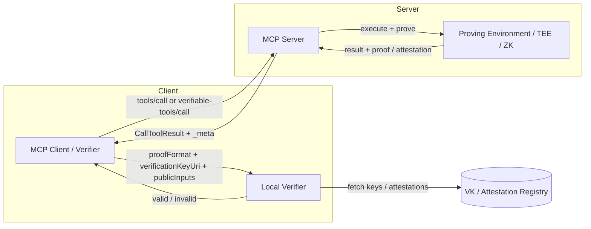
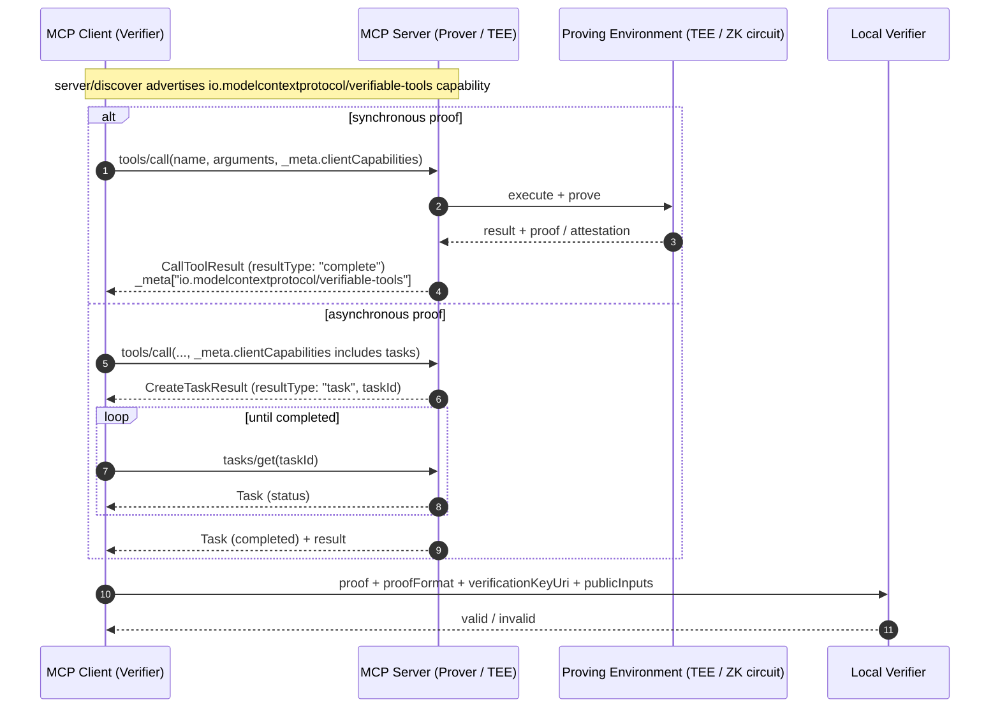
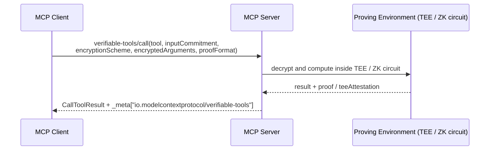

# SEP-{NUMBER}: Verifiable Tool Results Extension

> **Note**: This draft follows the [MCP SEP template](https://github.com/modelcontextprotocol/modelcontextprotocol/blob/main/seps/TEMPLATE.md) and is intended as an **Extensions Track** proposal for MCP `2026-07-28`.

- **Status**: Draft
- **Type**: Extensions Track
- **Created**: 2026-08-11
- **Author(s)**: (your name / @your-github-username)
- **Sponsor**: None (seeking sponsor)
- **PR**: https://github.com/modelcontextprotocol/modelcontextprotocol/pull/{NUMBER}

## Abstract

This proposal introduces an optional MCP extension, `io.modelcontextprotocol/verifiable-tools`, that lets servers attach cryptographic evidence to `tools/call` results. The evidence can be a zero-knowledge proof (ZKP), a TEE attestation, or another machine-verifiable artifact. Clients can validate the evidence locally to confirm that the returned data was produced by the expected computation on the expected inputs, without having to trust the server operator. This addresses a gap left by the strong authorization work in MCP `2026-07-28`: knowing *who* called a tool does not tell the caller whether the returned value was tampered with or computed incorrectly. The extension is purely optional, negotiated through the standard `extensions` capability map, and reuses the existing `io.modelcontextprotocol/tasks` extension for long-running proof generation.

### Overview



## Motivation

MCP `2026-07-28` makes the protocol stateless, adds `server/discover` for capability advertisement, hardens OAuth 2.1 authorization with RFC 9207 issuer validation, and moves long-running work to the `tasks` extension. These improvements solve deployment scale, routing, and access-control problems. They do not, however, guarantee the integrity or correctness of a tool result.

As AI agents increasingly operate over financial, healthcare, infrastructure, and governance systems, clients need more than authorization. They need **verifiability**: a way to check that the result `Y` was produced by applying the agreed-upon function `f` to the agreed-upon inputs `X`, and that neither `f` nor `X` was altered between the client request and the client response.

Zero-knowledge proving systems (ezkl, risc0, snarkjs, etc.) and TEE attestations (Intel SGX, AMD SEV, AWS Nitro) have matured to the point where such verification can be performed in milliseconds to seconds on commodity hardware. Standardizing how these artifacts are carried in MCP lets clients and servers interoperate without baking any single cryptographic library into the core protocol.

### Why authorization is not enough: the trust gap

MCP `2026-07-28` answers the question *"is this client allowed to call this tool on this server?"*. It says nothing about *"is the value that came back the value the tool was supposed to compute?"*. Today a client has exactly one option: trust the server operator. That was acceptable while MCP servers were local processes started by the same person who runs the client. It stops being acceptable when:

- **The server is a third party.** Agents increasingly call tools operated by someone else: a market-data vendor, a credit bureau, a compliance-screening service, another organization's agent. Authorization proves the client's identity to the server, not the server's correctness to the client.
- **The server can be compromised without its identity changing.** A supply-chain attack on a server's dependencies, a malicious insider, or a mis-deployed model version all keep OAuth tokens, TLS certificates, and `server/discover` output exactly the same while silently changing what the tool returns. Authorization cannot detect this; a pinned `circuitHash` can.
- **The result triggers an irreversible action.** Agents act on tool results: they place orders, approve loans, dispense medication, open firewall ports. There is no human review step between "value returned" and "value acted upon", so the value itself must carry its own evidence.
- **Accountability is required after the fact.** Regulators, auditors, and counterparties ask "which program produced this decision, on which inputs?". A signed log entry proves who *said* something happened; a proof shows that it *did*.

The following scenarios describe where this gap becomes concrete. They are the workloads the reference implementation targets (§Reference Implementation).

#### Scenario A: Agent-to-agent tool markets

An orchestrating agent buys results from specialist MCP servers it has never audited (a pricing engine, a legal-clause classifier, a geospatial routing tool) and pays per call. Without verifiability the buyer cannot distinguish a correct result from a cheaper approximation, a cached stale answer, or a fabricated one. With `circuitHash` pinned to the advertised program and a proof attached to every paid result, the market can settle on *"pay for verified results"*: the buyer verifies locally and only then releases payment. This is the pattern under which tool servers can be commoditized without a central rating authority.

#### Scenario B: Trading and treasury agents

A trading agent calls `riskScore(symbol)` on a vendor's server and sizes a position from the answer. A compromised vendor (or a man-in-the-middle after TLS termination in a corporate proxy) that returns a manipulated score is indistinguishable from an honest one. A proof that `riskScore` was evaluated by the pinned model on committed inputs, combined with an input-provenance attestation (§Input provenance) that the price feed came from the named exchange, gives the agent grounds to act. Deferred/sampled proofs (§Deferred proofs) let a high-frequency caller verify a random subset rather than paying for a proof on every call.

#### Scenario C: Regulated decisions on private data

A bank's agent calls `privateCreditCheck` on a scoring service. Two obligations conflict: the applicant's data must not be revealed to the service operator beyond what the computation needs, and the regulator must later be able to confirm that the *approved* scoring model, not a discriminatory variant, was applied. Blind execution (§Blind / committed-input tool calls) handles the first; a proof bound to the model's `circuitHash` handles the second. The proof, not a log entry, becomes the audit artifact.

#### Scenario D: Certified model inference in healthcare and safety systems

A clinical-decision or industrial-control agent calls a tool that runs a certified ML model (`ezkl`-style proofs of inference, or TEE attestation of the model container). The question "was the certified version used?" cannot be answered by authorization. `circuitHash` identifies the exact model artifact; the proof shows the returned inference came from it.

#### Scenario E: Multi-hop agent chains and delegated tool use

Agent A asks agent B for a result; B obtains it from server C. A only ever sees B. Because proofs are self-contained artifacts in `_meta`, B can forward C's proof unchanged, and A verifies it against C's `circuitHash` and verification key without trusting B. Verifiability composes along the chain; authorization does not.

#### Scenario F: Autonomous security responses

An agent monitoring a system decides to trigger an expensive or destructive action (halt a contract, isolate a host) based on a tool that determines "this state is exploitable". A proof that the exploitability predicate was evaluated by an audited program on the observed state (a *proof-of-exploit*, with the exploit input kept private) lets the receiving system act automatically while leaving nothing for an attacker to replay or spoof.

### What this extension does and does not guarantee

| Property | Guaranteed by | Notes |
|---|---|---|
| `Y = f(X)` for the pinned `f` (`circuitHash`) and committed `X` (`inputCommitment`) | ZK proof or TEE attestation | The core guarantee. |
| The returned `content` is the `Y` that was proven | `outputCommitment` in `publicInputs` | See §Result binding. |
| The proof answers *this* request and is not a replay | `nonce` in `publicInputs` | See §Result binding. |
| The plaintext of `X` is hidden from the server | Blind execution | Only with `verifiable-tools/call`; the server's proving environment still sees `X` unless FHE is used. |
| `X` itself is *true* (a real price, a real record) | **Not guaranteed** by this extension alone | Requires input provenance (§Input provenance): zkTLS / oracle attestations / signed data. |
| `f` is the *right* function (a good model, a correct algorithm) | **Not guaranteed** | Out of scope; `circuitHash` identifies `f`, it does not judge it. |
| The server will answer at all (liveness) | **Not guaranteed** | `requireProof` may cause refusals. |

## Specification

### Extension identifier

The extension identifier is:

```text
io.modelcontextprotocol/verifiable-tools
```

Third-party implementations MUST use a vendor-prefixed identifier they control, e.g. `com.example/verifiable-tools`, following the [extension identifier rules](https://modelcontextprotocol.io/extensions/overview).

### Target protocol version

This extension targets **MCP `2026-07-28`** and later. It relies on:

- Stateless, per-request `_meta` metadata.
- `server/discover` for capability advertisement.
- The `extensions` map in `ClientCapabilities` and `ServerCapabilities`.
- The `io.modelcontextprotocol/tasks` extension for asynchronous proof generation.
- `resultType` in every successful result response.
- `Mcp-Method` and `Mcp-Name` HTTP headers on Streamable HTTP transports.

### Capability object

Both client and server advertise the extension under the `extensions` capability map. The value is a JSON object with the following optional fields:

| Field | Type | Description |
|---|---|---|
| `proofFormats` | `string[]` | Proof / attestation formats the party supports, identified as `"{engine}-{majorVersion}"` (e.g. `"ezkl-v1"`, `"risc0-v1"`, `"snarkjs-v2"`, `"tee-sgx-dcap-v1"`). |
| `blindExecution` | `boolean` | Whether the party supports blind / committed-input tool calls. |
| `requireProof` | `boolean` | For clients: if true, the server SHOULD return a proof when it can; servers MAY omit results for calls they cannot prove. |
| `requireInputProvenance` | `boolean` | For clients: if true, results that consume external data MUST carry `inputAttestations` (see §Input provenance). |
| `blindEncryptionSchemes` | `string[]` | For servers: `encryptionScheme` values accepted by `verifiable-tools/call`, e.g. `["hpke-v1"]`. REQUIRED when `blindExecution: true` on a server. |
| `blindPublicKeys` | `object` | For servers: map from `encryptionScheme` value to that scheme's base64url public key, for every listed scheme that encrypts to a server-held recipient key (`hpke-v1`: raw X25519). REQUIRED when `blindExecution: true` and at least one such scheme is listed. Client-keyed schemes (the reserved `fhe-tfhe-v1`, where the client holds the decryption key) MUST NOT have an entry. |
| `resultTtlMs` | `number` | For servers: how long a `resultId` stays provable via `verifiable-tools/prove`. REQUIRED when the server may emit `resultId`; clients MUST treat a `resultId` from a server that did not advertise `resultTtlMs` as unprovable. |

Example `server/discover` response:

```json
{
  "jsonrpc": "2.0",
  "id": "discover-1",
  "result": {
    "resultType": "complete",
    "supportedVersions": ["2026-07-28"],
    "capabilities": {
      "tools": {},
      "extensions": {
        "io.modelcontextprotocol/verifiable-tools": {
          "proofFormats": ["ezkl-v1", "tee-sgx-dcap-v1"],
          "blindExecution": true,
          "blindEncryptionSchemes": ["hpke-v1"],
          "blindPublicKeys": { "hpke-v1": "<base64url X25519 public key>" },
          "resultTtlMs": 86400000
        },
        "io.modelcontextprotocol/tasks": {}
      }
    },
    "_meta": {
      "io.modelcontextprotocol/serverInfo": {
        "name": "example-verifiable-server",
        "version": "1.0.0"
      }
    }
  }
}
```

### Request metadata

A client requesting verifiable output includes the extension under `extensions` in its per-request `io.modelcontextprotocol/clientCapabilities`, and MAY add request-specific options in `_meta`:

```json
{
  "jsonrpc": "2.0",
  "id": 1,
  "method": "tools/call",
  "params": {
    "name": "calculateRisk",
    "arguments": { "symbol": "AAPL" },
    "_meta": {
      "io.modelcontextprotocol/protocolVersion": "2026-07-28",
      "io.modelcontextprotocol/clientInfo": { "name": "trading-agent", "version": "1.0.0" },
      "io.modelcontextprotocol/clientCapabilities": {
        "extensions": {
          "io.modelcontextprotocol/verifiable-tools": {
            "proofFormats": ["ezkl-v1"],
            "requireProof": true
          },
          "io.modelcontextprotocol/tasks": {}
        }
      },
      "io.modelcontextprotocol/verifiable-tools": {
        "requestedProofFormat": "ezkl-v1",
        "nonce": "0x5f1c3a9e7b2d4c6f8a1e0d3b5c7f9a2e"
      }
    }
  }
}
```

| Request option | Type | Description |
|---|---|---|
| `requestedProofFormat` | `string` | Preferred format among the negotiated intersection. |
| `nonce` | `string` | Lower-case hex with `0x` prefix encoding 16–64 bytes (`^0x[0-9a-f]{32,128}$`). The server MUST bind it into the proof and echo it back. See §Result binding. |
| `replyPublicKey` | `string` | For blind calls: base64url raw X25519 public key to which the server encrypts `content` under `hpke-v1` when the tool's output must also stay confidential. See §Encrypted replies. |

On HTTP transports the request MUST also include:

```http
MCP-Protocol-Version: 2026-07-28
Mcp-Method: tools/call
Mcp-Name: calculateRisk
```

### Verifiable tool result

When the extension is negotiated and the server can produce a proof, the `tools/call` result includes the verifiable evidence in `result._meta["io.modelcontextprotocol/verifiable-tools"]`.

```json
{
  "jsonrpc": "2.0",
  "id": 1,
  "result": {
    "resultType": "complete",
    "content": [
      { "type": "text", "text": "42" }
    ],
    "isError": false,
    "_meta": {
      "io.modelcontextprotocol/serverInfo": {
        "name": "example-verifiable-server",
        "version": "1.0.0"
      },
      "io.modelcontextprotocol/verifiable-tools": {
        "proof": "0x8f3a...",
        "proofFormat": "ezkl-v1",
        "circuitHash": "0x12ab...",
        "verificationKeyUri": "https://example.com/vk/0x12ab...",
        "publicInputs": ["0x3b7e...", "0xdeadbeef...", "0x5f1c3a9e7b2d4c6f8a1e0d3b5c7f9a2e"],
        "outputCommitment": "0x3b7e...",
        "inputCommitment": "0xdeadbeef...",
        "nonce": "0x5f1c3a9e7b2d4c6f8a1e0d3b5c7f9a2e",
        "teeAttestation": "0x9c2f..."
      }
    }
  }
}
```

Field definitions:

| Field | Type | Required | Description |
|---|---|---|---|
| `proof` | `string` | Recommended | The zero-knowledge proof or attestation, encoded as a hex string or base64. Servers MAY return a URI instead if the proof is large; see `proofUri`. |
| `proofUri` | `string` (URI) | Optional | Location to fetch the proof artifact if it is too large for inline transport. |
| `proofFormat` | `string` | Recommended | The engine and major version used to produce the proof, e.g. `"ezkl-v1"`, `"risc0-v1"`, `"tee-sgx-dcap-v1"`. |
| `circuitHash` | `string` | Recommended | A cryptographic hash identifying the circuit, program, or Docker artifact that was executed. |
| `verificationKeyUri` | `string` (URI) | Optional | Location of the verification key needed to check the proof. |
| `publicInputs` | `array` | Conditional | Public inputs required to verify the proof, in the order `[outputCommitment, inputCommitment, nonce, ...format-specific]`. Index 2 is fixed: when the client supplied no nonce, `publicInputs[2]` MUST be the empty hex string `"0x"` so the format-specific tail always starts at index 3. Omitted for pure TEE attestations. |
| `teeAttestation` | `string` | Optional | A TEE attestation document, for cases where the computation ran inside a trusted execution environment. |
| `inputCommitment` | `string` | Required | REQUIRED whenever `proof` or `teeAttestation` is present. Commitment to the inputs used, so the client can verify that the proof was generated against the same arguments it supplied. See §Result binding for the commitment construction. |
| `outputCommitment` | `string` | Required | REQUIRED whenever `proof` or `teeAttestation` is present. `SHA-256` of the canonical encoding of `content`, so the client can verify that the proven output is the returned output. See §Result binding. |
| `nonce` | `string` | Conditional | Echo of the client-supplied `nonce` from the request metadata. REQUIRED when the client supplied one. |
| `inputAttestations` | `object[]` | Optional | Provenance evidence for external inputs consumed by the tool (e.g. a zkTLS transcript proof, an oracle signature). See §Input provenance. |
| `resultId` | `string` | Optional | Opaque identifier the client can later pass to `verifiable-tools/prove` to obtain a proof for this result. See §Deferred proofs. |
| `encryptedContent` | `boolean` | Optional | Whether `content` was encrypted under §Encrypted replies. |

The server MUST only emit `proofFormat` values it advertised in its capability object. The client MUST only attempt to verify formats it advertised.
A result that carries `proof` or `teeAttestation` but lacks either commitment MUST be treated by the verifier as unverified (equivalent to no proof).

### Result binding

A proof is only useful if the client can tie it to the exact request it made and the exact result it received. Three bindings are defined.

**Input binding.** `inputCommitment = "0x" || hex(SHA-256(salt || JCS(arguments)))` where `JCS` is the JSON Canonicalization Scheme ([RFC 8785](https://www.rfc-editor.org/rfc/rfc8785)). `salt` is either empty or exactly 32 bytes from a cryptographically secure random source. For plain `tools/call` the salt MUST be empty (no request field carries it, and the arguments are visible to the server anyway), so `inputCommitment = "0x" || hex(SHA-256(JCS(arguments)))`. For `verifiable-tools/call` the salt MUST be 32 random bytes and MUST be carried inside `encryptedArguments`, so that the commitment is *hiding* and a network observer cannot brute-force low-entropy arguments from the commitment. Servers MUST reject a blind call whose decrypted salt is not 32 bytes with `-32602`.

**Output binding.** `outputCommitment = "0x" || hex(SHA-256(JCS(content)))` over the `content` array of the `CallToolResult`. When `publicInputs` is present, `publicInputs[0]` MUST always be `outputCommitment`; `publicInputs[1]` MUST be `inputCommitment`; `publicInputs[2]` MUST be the request `nonce`, or the empty hex string `"0x"` when the client supplied no nonce, so the format-specific tail always starts at index 3. Formats whose circuit exposes the raw output as a public signal include it additionally in the format-specific tail.

**Request binding.** A client MAY include a fresh random `nonce` in `params._meta["io.modelcontextprotocol/verifiable-tools"].nonce`. A valid nonce is lower-case hex with a `0x` prefix encoding 16–64 bytes (`^0x[0-9a-f]{32,128}$`). If present, the server MUST bind it into the proof (as a public input, or in the signed/attested payload) and echo it in the result metadata. When the client supplied no nonce, `publicInputs[2]` MUST be the empty hex string `"0x"` so the format-specific tail always starts at index 3. The server MUST reject a request whose `nonce` is present but does not match this grammar with `-32602`. Uniqueness is the client's responsibility: the server does not track nonces; the client MUST generate a fresh nonce per request and MUST reject a result whose echoed nonce it did not issue for that request. Clients that need freshness (any tool whose correct answer changes over time, e.g. prices, balances, health checks) SHOULD always send a nonce; otherwise a server can replay a proof that was valid for an earlier call.

A verifier therefore checks, in order: (1) `proofFormat` was negotiated; (2) `circuitHash` matches the pinned hash for the tool *and the negotiated format* (§Tool descriptor metadata); (3) `inputCommitment` equals its own recomputation; (4) `outputCommitment` equals `SHA-256(JCS(content))`; (5) `nonce` matches what it sent; (6) the proof / attestation verifies under the pinned verification key.

### Tool descriptor metadata

The client needs a trustworthy mapping *tool name → circuitHash* before it can reject a result whose `circuitHash` does not match. Servers that support this extension SHOULD publish that mapping in `tools/list` under each tool's `_meta`:

```json
{
  "name": "riskScore",
  "description": "...",
  "inputSchema": { "type": "object" },
  "_meta": {
    "io.modelcontextprotocol/verifiable-tools": {
      "circuitHash": "0x12ab...",
      "proofFormats": ["snarkjs-v2", "noir-v1"],
      "proofPolicy": "onDemand",
      "verificationKeyUri": "https://example.com/vk/0x12ab...",
      "formats": {
        "snarkjs-v2": {
          "circuitHash": "0x12ab...",
          "verificationKeyUri": "https://example.com/vk/snarkjs/0x12ab..."
        },
        "noir-v1": {
          "circuitHash": "0x34cd...",
          "verificationKeyUri": "https://example.com/vk/noir/0x34cd..."
        }
      },
      "blind": false
    }
  }
}
```

| Field | Type | Description |
|---|---|---|
| `circuitHash` | `string` | The hash the server will use for this tool. |
| `proofFormats` | `string[]` | Formats available for this tool (subset of the capability-level list). |
| `proofPolicy` | `"always" \| "onDemand" \| "sampled"` | Whether every call carries a proof, whether proofs are produced only on request (§Deferred proofs), or whether the server proves a fraction of calls. |
| `verificationKeyUri` | `string` | Where to fetch the verification key for `circuitHash`. |
| `formats` | `object` | Optional per-format overrides: `{ "<proofFormat>": { "circuitHash", "verificationKeyUri" } }`. When present for the negotiated format, its values take precedence over the top-level `circuitHash` / `verificationKeyUri`, which then act as defaults. Servers offering formats with distinct artifacts (e.g. `snarkjs-v2` and `noir-v1` for one tool) MUST use `formats`. |
| `blind` | `boolean` | Whether the tool accepts `verifiable-tools/call`. |

The descriptor is a *hint*, not a root of trust: a malicious server controls `tools/list`. Clients MUST pin `circuitHash` and verification keys on first use (TOFU) or, preferably, obtain them from an out-of-band registry (a signed manifest, a package registry, a transparency log). A change in `circuitHash` for a known tool MUST be surfaced to the user or policy layer rather than silently accepted.

### Input provenance

A proof that `Y = f(X)` says nothing about whether `X` is true. Many tools fetch `X` from somewhere else: a market-data API, a public registry, another MCP server. `inputAttestations` lets the server attach evidence about the origin of such inputs:

```json
"inputAttestations": [
  {
    "type": "zktls-tlsn-v1",
    "source": "https://api.exchange.example/v1/price/AAPL",
    "commitment": "0x77aa...",
    "proof": "0x...",
    "notaryKeyUri": "https://notary.example/keys/1"
  }
]
```

| Field | Type | Description |
|---|---|---|
| `type` | `string` | Provenance mechanism, `"{mechanism}-{majorVersion}"`, e.g. `"zktls-tlsn-v1"` (TLSNotary-style transcript proof), `"oracle-sig-v1"` (signed data feed), `"mcp-verifiable-v1"` (a nested verifiable result from an upstream MCP server, Scenario E). |
| `source` | `string` | Identifier of the data source (URL, feed id, upstream server). |
| `commitment` | `string` | Commitment to the fetched data, which MUST also appear as a public input of the main proof so that the two artifacts are linked. |
| `proof` / `proofUri` | `string` | The provenance artifact. |
| `notaryKeyUri` / `verificationKeyUri` | `string` | Key material for verifying the artifact. |

Clients that require provenance SHOULD declare it (`requireInputProvenance: true` in their capability object) and MUST NOT treat a result as verified if a required attestation is missing or fails.

If the server cannot produce a proof for a specific call but the call otherwise succeeds, it MUST return a normal `resultType: "complete"` response and MAY omit the `io.modelcontextprotocol/verifiable-tools` metadata. It MUST NOT fail the call solely because it cannot prove it, unless the client set `requireProof: true` and the server accepted that requirement.

### Asynchronous proof generation via Tasks

Proof generation can take seconds to minutes. This extension does not invent a new async pattern; it reuses the `io.modelcontextprotocol/tasks` extension. A server that needs time to generate a proof returns a task instead of the final tool result.

Example `tools/call` response that creates a task:

```json
{
  "jsonrpc": "2.0",
  "id": 1,
  "result": {
    "resultType": "task",
    "taskId": "task-uuid-1234",
    "status": "working",
    "createdAt": "2026-08-11T06:00:00Z",
    "lastUpdatedAt": "2026-08-11T06:00:00Z",
    "ttlMs": 300000,
    "pollIntervalMs": 2000
  }
}
```

The client polls `tasks/get` with the `taskId`. When the task reaches `completed`, the `result` field contains the same `CallToolResult` shape shown above, including the `io.modelcontextprotocol/verifiable-tools` metadata. `tasks/cancel` MUST abort proof generation, not merely mark the task cancelled.

```json
{
  "jsonrpc": "2.0",
  "id": 2,
  "method": "tasks/get",
  "params": {
    "taskId": "task-uuid-1234",
    "_meta": {
      "io.modelcontextprotocol/protocolVersion": "2026-07-28",
      "io.modelcontextprotocol/clientCapabilities": {
        "extensions": {
          "io.modelcontextprotocol/verifiable-tools": {},
          "io.modelcontextprotocol/tasks": {}
        }
      }
    }
  }
}
```

### Deferred proofs

Proving is expensive relative to executing, and many callers do not need a proof on every call: an auditor samples, a market settles disputes, a high-frequency agent spot-checks. To support these, a server MAY return a result *without* a proof but *with* a `resultId`, and prove it later on request.

```text
verifiable-tools/prove
```

| Field | Type | Required | Description |
|---|---|---|---|
| `resultId` | `string` | Yes | The `resultId` from an earlier result. |
| `proofFormat` | `string` | No | Preferred proof format. |
| `nonce` | `string` | No | Fresh nonce to bind into the deferred proof. |

`verifiable-tools/prove` is an ordinary JSON-RPC request on the same MCP session and transport as `tools/call`. It is available only after the extension has been negotiated by both parties; servers that have not advertised `resultTtlMs` MUST answer `-32601`. `resultId` MUST be unguessable (at least 128 bits from a cryptographically secure random source) and MUST be bound to the principal (authorization identity) and, where the transport has one, the session that made the original call; the server MUST answer `-32602` with `data.reason: "resultNotFound"` for any other caller, without distinguishing unknown from unauthorized identifiers. For results of blind calls whose `content` was returned encrypted to `replyPublicKey`, the deferred response MUST re-encrypt the same `originalContent` (see §Encrypted replies) under §Encrypted replies using the nonce of the `verifiable-tools/prove` request (or the original nonce if none was supplied); the ciphertext therefore differs while `outputCommitment`, computed over the plaintext, is unchanged. Request options (`proofFormat`, `nonce`) live in `params` directly, not under `_meta`.

The response is either a `CallToolResult` whose plaintext `content` (`originalContent` for encrypted replies) is byte-identical to the original and whose `_meta` now contains the proof, or a task (`resultType: "task"`) that resolves to one. The server MUST retain enough state, including any private witness required by the selected proof format (the plaintext arguments for ZK formats; the sealed execution record for TEE formats), together with the output and nonce, to prove the original computation for at least the `resultTtlMs` it advertises (REQUIRED when emitting `resultId`); after `resultTtlMs` has elapsed the server MUST reject the `resultId` with `-32602` and `data.reason: "resultExpired"` and MUST delete the retained witness. `resultExpired` is returned only to the principal (and session) the `resultId` is bound to; every other caller receives `resultNotFound` as above, so an outsider cannot learn whether an identifier ever existed.

Which mode is appropriate is a per-tool decision expressed by `proofPolicy`. `always` suits low-volume, high-value calls (Scenario C); `onDemand` and `sampled` suit high-volume calls where the *possibility* of being audited is the deterrent (Scenario B). A server that is caught returning an unprovable result under `sampled` should be treated by the client as untrusted for all past results in the same period.

### Blind / committed-input tool calls

Clients can request a tool call without revealing plaintext arguments to the server. The extension defines a new method:

```text
verifiable-tools/call
```

Parameters:

| Field | Type | Required | Description |
|---|---|---|---|
| `tool` | `string` | Yes | The name of the tool to invoke. |
| `inputCommitment` | `string` | Yes | Cryptographic commitment (hash) of the plaintext inputs. |
| `encryptionScheme` | `string` | Yes | Identifier for the encryption/key-agreement scheme. See the table below. |
| `encryptedArguments` | `string` | Yes | base64url string; the plaintext is the JCS encoding of `{ "salt": "0x...", "arguments": { ... } }`. |
| `proofFormat` | `string` | No | Preferred proof format. |

Defined `encryptionScheme` values:

| Value | Meaning | Who sees plaintext |
|---|---|---|
| `hpke-v1` | [RFC 9180](https://www.rfc-editor.org/rfc/rfc9180) HPKE, base mode, `DHKEM(X25519, HKDF-SHA256)` / `HKDF-SHA256` / `AES-128-GCM`. `encryptedArguments` = `base64url(enc \|\| ciphertext)` (unpadded, RFC 4648 §5); `enc` is the 32-byte X25519 encapsulated key, so the receiver splits the first 32 decoded bytes. AAD = `JCS({tool, inputCommitment, encryptionScheme})`. `info` = UTF-8 `"io.modelcontextprotocol/verifiable-tools/hpke-v1/args"`. | The proving environment (TEE or the machine running the prover). The MCP server process outside it MUST NOT. |
| `fhe-tfhe-v1` | Arguments encrypted under a client-held TFHE key; the tool is evaluated homomorphically and `content` is returned encrypted. Reserved: requires verifiable FHE to also obtain a correctness proof, which is not yet practical (§Open Questions). No server key; `blindPublicKeys` has no entry for this scheme. | Nobody but the client. |

The server's public key for `hpke-v1` is advertised in its capability object as `blindPublicKeys["hpke-v1"]` (base64url raw X25519 key) together with `blindEncryptionSchemes`. Because `server/discover` is the delivery channel, the key is only as trustworthy as that channel: on a TEE-backed server the key MUST be bound into the attestation's user-data field so the client can check that the key it encrypts to lives inside the attested enclave; otherwise it MUST be pinned like a verification key.

HTTP headers:

```http
MCP-Protocol-Version: 2026-07-28
Mcp-Method: verifiable-tools/call
```

`Mcp-Name` is only required by SEP-2243 for `tools/call`, `resources/read`, and `prompts/get`; it is not used for this custom method.

The server decrypts and evaluates the arguments inside a TEE or ZK circuit, computes the tool result, and returns the result with verifiable metadata. The plaintext arguments MUST NOT be logged or retained outside the execution environment. The server MUST recompute `inputCommitment` from the decrypted `salt` and `arguments` and reject the call with `-32602` on mismatch.

Blind execution hides *inputs*; it does not, by itself, hide anything about the *output*. A tool whose output is a function of a few private bits (e.g. `approved`/`declined`) leaks those bits to the operator. Tools with this shape SHOULD either return the output encrypted to the client (see §Encrypted replies) or run inside a TEE whose operator cannot read outputs.

#### Encrypted replies

Throughout this document `originalContent` denotes the plaintext `content` array as produced by the tool, before encryption; it is never transmitted as a field of its own.

When `replyPublicKey` is present the server MUST return `content` as a single `{ "type": "text", "text": "<base64url(enc || ciphertext)>" }` element, and the result `_meta["io.modelcontextprotocol/verifiable-tools"].encryptedContent` MUST be `true`. Encryption is `hpke-v1` base mode with the same suite as blind arguments, plaintext = `JCS(originalContent)`, AAD = `JCS({tool, inputCommitment, nonce})` (nonce omitted from the object when absent), and `info` = UTF-8 `"io.modelcontextprotocol/verifiable-tools/hpke-v1/reply"`. `outputCommitment` MUST be computed over the *plaintext* `originalContent`, so the client decrypts first and then runs the normal verification steps. `replyPublicKey` is ignored for non-blind `tools/call`.

Example request:

```json
{
  "jsonrpc": "2.0",
  "id": 3,
  "method": "verifiable-tools/call",
  "params": {
    "tool": "privateCreditCheck",
    "inputCommitment": "0xdeadbeef...",
    "encryptionScheme": "hpke-v1",
    "encryptedArguments": "<base64url(enc || ciphertext)>",
    "proofFormat": "tee-sgx-dcap-v1",
    "_meta": {
      "io.modelcontextprotocol/protocolVersion": "2026-07-28",
      "io.modelcontextprotocol/clientCapabilities": {
        "extensions": {
          "io.modelcontextprotocol/verifiable-tools": {
            "proofFormats": ["tee-sgx-dcap-v1"],
            "blindExecution": true
          }
        }
      },
      "io.modelcontextprotocol/verifiable-tools": {
        "nonce": "0x5f1c3a9e7b2d4c6f8a1e0d3b5c7f9a2e"
      }
    }
  }
}
```

Example response:

```json
{
  "jsonrpc": "2.0",
  "id": 3,
  "result": {
    "resultType": "complete",
    "content": [
      { "type": "text", "text": "approved" }
    ],
    "isError": false,
    "_meta": {
      "io.modelcontextprotocol/serverInfo": {
        "name": "private-credit-server",
        "version": "1.0.0"
      },
      "io.modelcontextprotocol/verifiable-tools": {
        "proof": "0x8f3a...",
        "proofFormat": "tee-sgx-dcap-v1",
        "inputCommitment": "0xdeadbeef...",
        "outputCommitment": "0x...",
        "nonce": "0x5f1c3a9e7b2d4c6f8a1e0d3b5c7f9a2e",
        "publicInputs": ["0x<outputCommitment>", "0x<inputCommitment>", "0x5f1c3a9e7b2d4c6f8a1e0d3b5c7f9a2e"],
        "teeAttestation": "0x9c2f..."
      }
    }
  }
}
```

### Verification flow

#### Synchronous and asynchronous tool calls



#### Blind / committed-input tool calls



A client MUST NOT act on a tool result whose proof fails verification unless it has an explicit out-of-band trust relationship with the server.

### TEE attestation formats

For `proofFormat` values of the form `tee-{platform}-v{N}` the `proof` is a signature over `circuitHash || inputCommitment || outputCommitment || nonce` by a key that lives inside the attested environment, and `teeAttestation` is the platform's attestation document. The verifier MUST check all of:

1. The attestation document's certificate chain terminates at the platform vendor's root (AWS Nitro: COSE_Sign1 with the Nitro root; Intel SGX: DCAP quote with Intel PCS collateral; AMD SEV-SNP: VCEK chain).
2. The measurement in the document (Nitro PCRs, SGX `MRENCLAVE`, SNP launch digest) equals the measurement the client has pinned for `circuitHash`. `circuitHash` for TEE formats SHOULD be defined as a hash over the measurement plus the reproducible-build recipe that produces it.
3. The document's user-data / report-data field contains the signing public key used for `proof` (and `blindPublicKeys["hpke-v1"]` if blind execution is offered), so the key is provably enclave-resident.
4. The document is fresh: it either embeds the request `nonce` or was issued within a client-defined window.

Defined values: `tee-nitro-v1`, `tee-sgx-dcap-v1`, `tee-sevsnp-v1`.

## Rationale

### Why an extension rather than a core protocol change?

MCP's design principles favor a small, stable core and experimentation in extensions. Requiring every MCP implementation to embed ZKP or TEE verification libraries would violate "Interoperability over optimization" and "Stability over velocity." By making verifiability an optional extension, clients and servers that need it can negotiate it, while lightweight implementations remain unaffected.

### Why reuse the Tasks extension for async proving?

The `2026-07-28` release introduced a robust, officially supported model for long-running work. Defining a second async lifecycle inside this extension would fragment the ecosystem and force clients to implement two polling models. Reusing Tasks gives clients a single, well-defined path for async tool calls.

### Why put evidence in `_meta` instead of `content`?

Tool `content` is intended for human or model-readable output. Cryptographic proofs are machine-readable artifacts that should not be tokenized or displayed to users. `_meta` is the standard extension point for protocol-level metadata, and its key-naming rules let us reserve a single, well-defined key for this extension.

### Why support both ZKP and TEE attestations?

Different workloads suit different technologies. ZKPs give cryptographic guarantees without trusting hardware vendors but can be expensive to generate. TEEs are often faster and easier to deploy but introduce hardware-rooted trust assumptions. Supporting both lets the ecosystem converge on a common transport without mandating a single proof technology.

Indicative trade-offs (orders of magnitude; the reference implementation publishes measured figures per format in Phase 2/3):

| Family | Example formats | Prove cost vs. native execution | Proof size | Verify cost | Trust assumption | Best fit |
|---|---|---|---|---|---|---|
| Pairing SNARK (Groth16 / PLONK) | `snarkjs-v2`, Noir/UltraHonk | 10^3–10^6× | ~0.1–1 KB | ms | Trusted setup (Groth16: per-circuit; PLONK: universal) | Small fixed circuits, on-chain verification |
| zkVM (STARK, optionally wrapped in Groth16) | `risc0-v1`, SP1 | 10^4–10^6× | 100 KB–MB (STARK), ~0.2 KB wrapped | ms–s | None beyond hash / field assumptions | Arbitrary programs, existing code |
| ZKML | `ezkl-v1` | very high, model-size dependent | KB–MB | ms–s | As underlying SNARK | Certified model inference (Scenario D) |
| TEE attestation | `tee-nitro-v1`, `tee-sgx-dcap-v1`, `tee-sevsnp-v1` | ~1× | ~1–10 KB (document + chain) | ms | Hardware vendor, firmware, side-channel resistance | Latency-sensitive, large or I/O-heavy tools; blind execution |
| FHE (reserved) | `fhe-tfhe-v1` | 10^3–10^6×, and no correctness proof without vFHE | n/a | n/a | None for confidentiality; correctness unproven | Output confidentiality (future) |

### Why not just sign results?

A plain server signature over `(inputs, output)` proves *origin* ("this server said Y") and gives non-repudiation, but not *correctness* ("Y = f(X)"): a compromised or dishonest server signs wrong answers just as happily. Signatures are still useful as a cheap first step and are what `demo-sig-v1` in the reference implementation models; the extension is designed so that upgrading from a signature to an attestation-backed signature to a ZK proof changes only `proofFormat`, not the transport.

### Why include input provenance and deferred proofs?

Early reviewers of this proposal asked two questions repeatedly. (1) *"If the tool reads a price from an API, what does the proof mean?"*: nothing about the price. `inputAttestations` gives the extension a place for zkTLS / oracle evidence so that "correct computation on authentic data" can be expressed end-to-end, and Scenario E shows how nested MCP results reuse the same slot. (2) *"Who pays for proving on every call?"*: often nobody should. `proofPolicy` and `verifiable-tools/prove` let the economic pattern (prove-always, prove-on-audit, prove-a-sample) be chosen per tool rather than baked into the protocol.

## Backward Compatibility

This extension is **fully backward compatible**.

- Servers and clients that do not support the extension continue to use the core `tools/call` flow unchanged.
- The extension is negotiated only when both parties include `io.modelcontextprotocol/verifiable-tools` in their `extensions` capability map.
- `_meta` keys prefixed with `io.modelcontextprotocol/verifiable-tools` are ignored by implementations that do not recognize the extension.
- Unrecognized `resultType` values continue to be treated as invalid by clients, as per the core protocol. This extension does not introduce new `resultType` values; it relies on the existing `"complete"` result type and the `io.modelcontextprotocol/tasks` extension's `"task"` result type.

## Security Implications

- **Verification key distribution**: A proof is only as trustworthy as the verification key. Servers SHOULD publish `verificationKeyUri` over an integrity-protected channel, and clients SHOULD pin or cache known-good keys for a given `circuitHash`.
- **Circuit / program identity**: `circuitHash` must uniquely identify the computation. If the same hash can map to different implementations, the integrity guarantee is weakened.
- **Proof format negotiation**: The client and server MUST intersect their advertised `proofFormats`. A server MUST NOT use an unadvertised format, and a client MUST reject a format it did not request.
- **Blind execution**: Encrypted arguments must be decrypted only inside the proving environment. Servers MUST NOT persist plaintext inputs or forward them to untrusted downstream systems.
- **Side channels**: Proof generation time can leak information about inputs. Implementations SHOULD use constant-time or padded proving schedules where side-channel resistance is required.
- **Availability**: If `requireProof: true` is set and the server cannot generate a proof, the server may refuse the call. Clients SHOULD handle this gracefully.
- **Replay**: Without a `nonce`, a valid proof for an earlier call is also a valid proof for the current one. Clients MUST send a nonce for any tool whose correct output is time-dependent, and MUST reject results whose echoed nonce differs.
- **Output substitution**: Without `outputCommitment` bound into the proof, a server can pair a genuine proof with a different `content`. Verifiers MUST recompute `outputCommitment` from `content`.
- **Hiding commitments**: An unsalted hash of low-entropy arguments (an account number, a yes/no flag) is trivially inverted by anyone who sees the commitment. Blind calls MUST use a 32-byte random salt.
- **Deferred-proof retrieval**: `resultId` is a bearer capability to retained `content`. It MUST be unguessable, scoped to the original caller, and expire with `resultTtlMs`.
- **Input provenance**: A verified proof over fabricated inputs is worthless. Clients acting on externally sourced data SHOULD require `inputAttestations` and verify them independently of the main proof.
- **Descriptor trust**: `tools/list` metadata is server-controlled. Pin `circuitHash` / keys out of band or on first use; treat changes as security events.
- **Randomness reuse**: Ed25519 is deterministic, but Schnorr/ECDSA-style signing in custom TEE code, and Beaver-triple or mask reuse in MPC-based provers, leak keys or inputs when randomness is reused. Implementations MUST use fresh randomness per proof and SHOULD include a negative test for reuse.
- **Key revocation**: Verification keys, TEE signing keys, and notary keys can be compromised. Clients SHOULD check a revocation source (a transparency log or a signed revocation list at a well-known URI relative to `verificationKeyUri`) before trusting a key they have not used recently.

## Reference Implementation

A reference implementation is required before this SEP can reach "Final" status. The prototype lives at <https://github.com/ripple-node-lab/mcp-verifiable-tools-demo> (TypeScript, MCP `2026-07-28` Streamable HTTP, `npm install && npm test`). Its plan (`docs/PLAN.md`) is staged so that reviewers can run each stage without heavy toolchains:

- Phase 1 (done): transport, negotiation, Tasks integration, and blind calls with dependency-free stand-in formats (`demo-sig-v1`, `demo-commit-v1`). These are *not* cryptographic proofs and are labelled as such.
- Phase 2-b: two real ZK formats that run in-process from npm (`snarkjs-v2` Groth16 over a Circom circuit and `noir-v1` UltraHonk), plus the result-binding fields of this revision and measured proving/verification figures.
- Phase 3: sidecar-based formats where the prover is not TypeScript: `risc0-v1` (Rust zkVM), `ezkl-v1` (Python/CLI prover, WASM verifier), `tee-nitro-v1` (attestation verification in TypeScript, enclave build opt-in), and a `zktls-tlsn-v1` input attestation for the price-feed scenario.
- Phase 4: port of the protocol layer to `modelcontextprotocol/typescript-sdk`.

CI results and per-format benchmarks will be linked here as each phase lands.

### Non-normative appendix: format profiles implemented by the reference demo

The reference demo implements these concrete profiles for `add`. Both bind
`publicInputs = [outputCommitment, inputCommitment, nonce ?? "0x", ...nativeTail]`.

- `snarkjs-v2`: `proof` is unpadded base64url of JCS-serialized snarkjs
  Groth16 JSON; the native tail is decimal `[c, a, b]`. The verification-key
  document is the committed Circom `vk.json` bytes.
- `noir-v1`: `proof` is `0x` plus lowercase hexadecimal proof bytes; the native
  tail is padded lowercase hexadecimal field strings `[a, b, c]`. The
  verification-key document is JCS JSON
  `{"format":"noir-v1","vk":"<base64url raw vk bytes>"}`.

For both profiles, `circuitHash` is `0x` plus SHA-256 of the exact bytes served
at `verificationKeyUri`, including JSON serialization and whitespace.

## Performance Implications

- Proof generation can be orders of magnitude slower than the underlying computation. This is why async generation via Tasks is the default pattern, and why `proofPolicy: "onDemand" | "sampled"` exists for high-volume tools.
- Verification is typically fast (milliseconds to seconds) and should run on the client.
- Large proofs SHOULD be served via `proofUri` or `verificationKeyUri` rather than inlined in `_meta`.
- Every format definition MUST report: proving time and memory for the reference circuit, proof size, verification time, and verifier dependency footprint (npm/WASM vs. native). The reference implementation records these per format so that `proofFormats` negotiation can be cost-aware.

## Testing Plan

- Conformance tests verifying that servers only emit advertised `proofFormats`.
- Tests proving that clients ignore `io.modelcontextprotocol/verifiable-tools` metadata when the extension is not negotiated.
- Tests for the async path: a `tools/call` that returns a task, and a `tasks/get` that resolves to a verifiable result.
- Negative tests: invalid proofs, mismatched `circuitHash`, unknown `proofFormat`, and malformed blind inputs.
- Binding tests: a genuine proof paired with altered `content` is rejected (`outputCommitment`); a proof replayed from a previous call is rejected (`nonce`); an unsalted or wrongly salted blind commitment is rejected.
- Provenance tests: a result with a valid main proof but a missing or invalid required `inputAttestations` entry is rejected.
- Deferred-proof tests: `verifiable-tools/prove` returns byte-identical plaintext `content` and a verifying proof; an expired `resultId` is rejected.
- Descriptor tests: a `tools/list` entry whose `circuitHash` differs from the pinned value is surfaced, not silently accepted.

## Alternatives Considered

- **Embedding proof data inside tool `content` as a new content type**: Rejected because it mixes machine-verifiable artifacts with user-facing content and complicates client rendering.
- **Adding a new synchronous `resultType` for "proof pending"**: Rejected in favor of reusing the official `io.modelcontextprotocol/tasks` extension.
- **Requiring every MCP server to verify proofs**: Rejected; verification is a client-side concern, and the extension only standardizes the transport of proof data.
- **Plain signed results (no proof)**: Insufficient alone (see Rationale) but supported as the lowest rung of `proofFormat`, so adopters can start there.
- **zkTLS-only (prove the data source, not the computation)**: Complementary, not alternative; adopted as `inputAttestations`.
- **Mandating a single proof system (e.g. Groth16) for interoperability**: Rejected; the field moves too fast, and TEE deployments would be excluded. Interoperability is addressed by per-format definitions and the binding rules, which are engine-independent.

## Open Questions

- Should MCP define a registry of `proofFormat` values, or should discovery rely entirely on capability strings?
- Should `circuitHash` include a reproducible build recipe (e.g. Dockerfile digest, Nix flake hash) in addition to the circuit artifact?
- How should clients handle revocation of verification keys or TEE signing keys?
- Should this extension also apply to `resources/read` and `prompts/get`, or remain scoped to `tools/call`?
- What is the canonical encoding for `publicInputs` to maximize interoperability across ZKP libraries? (This revision fixes `publicInputs[0]` and the commitment construction; field-element encoding for the remaining entries is still per-format.)
- Verifiable FHE: `fhe-tfhe-v1` is reserved, but FHE alone gives confidentiality without correctness. What is the minimum viable vFHE construction (proof over the homomorphic evaluation, or TEE-hosted FHE evaluation) worth standardizing?
- MPC / co-SNARK provers: when inputs come from several parties (Scenario A with multiple data providers), should the extension describe a multi-prover `inputCommitment` (one commitment per party) or leave that to the format?
- Economics: should the capability object carry a price or cost hint per `proofFormat` so that agents in a tool market (Scenario A) can choose between `always`, `onDemand`, and `sampled` automatically?
- Which working group / interest group should incubate this as an `experimental-ext-*` extension before an SEP is filed?
