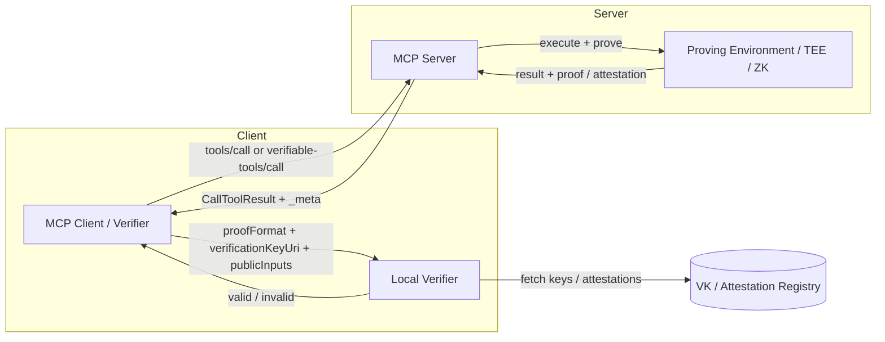
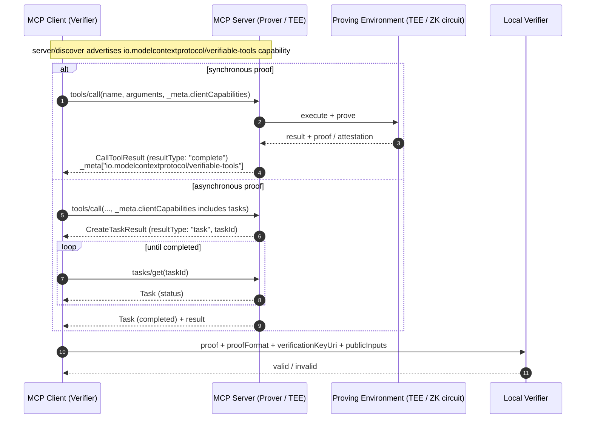
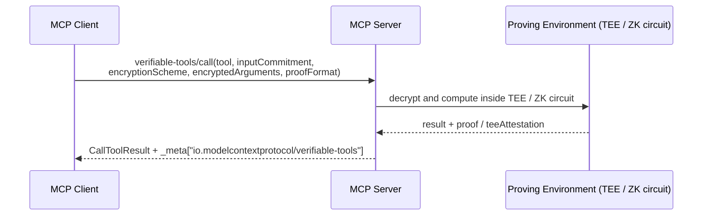

# SEP-{NUMBER}: Verifiable Tool Results Extension

> **Note**: This draft follows the [MCP SEP template](https://github.com/modelcontextprotocol/modelcontextprotocol/blob/main/seps/TEMPLATE.md) and is intended as an **Extensions Track** proposal for MCP `2026-07-28`.

- **Status**: Draft
- **Type**: Extensions Track
- **Created**: 2026-08-11
- **Author(s)**: (your name / @your-github-username)
- **Sponsor**: None (seeking sponsor)
- **PR**: https://github.com/modelcontextprotocol/modelcontextprotocol/pull/{NUMBER}

## Abstract

This proposal introduces an optional MCP extension, `io.modelcontextprotocol/verifiable-tools`, that lets servers attach cryptographic evidence to `tools/call` results. The evidence can be a zero-knowledge proof (ZKP), a TEE attestation, or another machine-verifiable artifact. Clients can validate the evidence locally to confirm that the returned data was produced by the expected computation on the expected inputs, without having to trust the server operator. This addresses a gap left by the strong authorization work in MCP `2026-07-28`: knowing *who* called a tool does not tell the caller whether the returned value was tampered with or computed incorrectly. The extension is purely optional, negotiated through the standard `extensions` capability map, and reuses the existing `io.modelcontextprotocol/tasks` extension for long-running proof generation.

### Overview



## Motivation

MCP `2026-07-28` makes the protocol stateless, adds `server/discover` for capability advertisement, hardens OAuth 2.1 authorization with RFC 9207 issuer validation, and moves long-running work to the `tasks` extension. These improvements solve deployment scale, routing, and access-control problems. They do not, however, guarantee the integrity or correctness of a tool result.

As AI agents increasingly operate over financial, healthcare, infrastructure, and governance systems, clients need more than authorization. They need **verifiability**: a way to check that the result `Y` was produced by applying the agreed-upon function `f` to the agreed-upon inputs `X`, and that neither `f` nor `X` was altered between the client request and the client response.

Zero-knowledge proving systems (ezkl, risc0, snarkjs, etc.) and TEE attestations (Intel SGX, AMD SEV, AWS Nitro) have matured to the point where such verification can be performed in milliseconds to seconds on commodity hardware. Standardizing how these artifacts are carried in MCP lets clients and servers interoperate without baking any single cryptographic library into the core protocol.

## Specification

### Extension identifier

The extension identifier is:

```text
io.modelcontextprotocol/verifiable-tools
```

Third-party implementations MUST use a vendor-prefixed identifier they control, e.g. `com.example/verifiable-tools`, following the [extension identifier rules](https://modelcontextprotocol.io/extensions/overview).

### Target protocol version

This extension targets **MCP `2026-07-28`** and later. It relies on:

- Stateless, per-request `_meta` metadata.
- `server/discover` for capability advertisement.
- The `extensions` map in `ClientCapabilities` and `ServerCapabilities`.
- The `io.modelcontextprotocol/tasks` extension for asynchronous proof generation.
- `resultType` in every successful result response.
- `Mcp-Method` and `Mcp-Name` HTTP headers on Streamable HTTP transports.

### Capability object

Both client and server advertise the extension under the `extensions` capability map. The value is a JSON object with the following optional fields:

| Field | Type | Description |
|---|---|---|
| `proofFormats` | `string[]` | Proof / attestation formats the party supports, identified as `"{engine}-{majorVersion}"` (e.g. `"ezkl-v1"`, `"risc0-v1"`, `"snarkjs-v2"`, `"tee-sgx-v1"`). |
| `blindExecution` | `boolean` | Whether the party supports blind / committed-input tool calls. |
| `requireProof` | `boolean` | For clients: if true, the server SHOULD return a proof when it can; servers MAY omit results for calls they cannot prove. |

Example `server/discover` response:

```json
{
  "jsonrpc": "2.0",
  "id": "discover-1",
  "result": {
    "resultType": "complete",
    "supportedVersions": ["2026-07-28"],
    "capabilities": {
      "tools": {},
      "extensions": {
        "io.modelcontextprotocol/verifiable-tools": {
          "proofFormats": ["ezkl-v1", "tee-sgx-v1"],
          "blindExecution": true
        },
        "io.modelcontextprotocol/tasks": {}
      }
    },
    "_meta": {
      "io.modelcontextprotocol/serverInfo": {
        "name": "example-verifiable-server",
        "version": "1.0.0"
      }
    }
  }
}
```

### Request metadata

A client requesting verifiable output includes the extension under `extensions` in its per-request `io.modelcontextprotocol/clientCapabilities`, and MAY add request-specific options in `_meta`:

```json
{
  "jsonrpc": "2.0",
  "id": 1,
  "method": "tools/call",
  "params": {
    "name": "calculateRisk",
    "arguments": { "symbol": "AAPL" },
    "_meta": {
      "io.modelcontextprotocol/protocolVersion": "2026-07-28",
      "io.modelcontextprotocol/clientInfo": { "name": "trading-agent", "version": "1.0.0" },
      "io.modelcontextprotocol/clientCapabilities": {
        "extensions": {
          "io.modelcontextprotocol/verifiable-tools": {
            "proofFormats": ["ezkl-v1"],
            "requireProof": true
          },
          "io.modelcontextprotocol/tasks": {}
        }
      },
      "io.modelcontextprotocol/verifiable-tools": {
        "requestedProofFormat": "ezkl-v1"
      }
    }
  }
}
```

On HTTP transports the request MUST also include:

```http
MCP-Protocol-Version: 2026-07-28
Mcp-Method: tools/call
Mcp-Name: calculateRisk
```

### Verifiable tool result

When the extension is negotiated and the server can produce a proof, the `tools/call` result includes the verifiable evidence in `result._meta["io.modelcontextprotocol/verifiable-tools"]`.

```json
{
  "jsonrpc": "2.0",
  "id": 1,
  "result": {
    "resultType": "complete",
    "content": [
      { "type": "text", "text": "42" }
    ],
    "isError": false,
    "_meta": {
      "io.modelcontextprotocol/serverInfo": {
        "name": "example-verifiable-server",
        "version": "1.0.0"
      },
      "io.modelcontextprotocol/verifiable-tools": {
        "proof": "0x8f3a...",
        "proofFormat": "ezkl-v1",
        "circuitHash": "0x12ab...",
        "verificationKeyUri": "https://example.com/vk/0x12ab...",
        "publicInputs": ["42", "0xdeadbeef..."],
        "teeAttestation": "0x9c2f..."
      }
    }
  }
}
```

Field definitions:

| Field | Type | Required | Description |
|---|---|---|---|
| `proof` | `string` | Recommended | The zero-knowledge proof or attestation, encoded as a hex string or base64. Servers MAY return a URI instead if the proof is large; see `proofUri`. |
| `proofUri` | `string` (URI) | Optional | Location to fetch the proof artifact if it is too large for inline transport. |
| `proofFormat` | `string` | Recommended | The engine and major version used to produce the proof, e.g. `"ezkl-v1"`, `"risc0-v1"`, `"tee-sgx-v1"`. |
| `circuitHash` | `string` | Recommended | A cryptographic hash identifying the circuit, program, or Docker artifact that was executed. |
| `verificationKeyUri` | `string` (URI) | Optional | Location of the verification key needed to check the proof. |
| `publicInputs` | `array` | Conditional | Public inputs required to verify the proof. Omitted for pure TEE attestations. |
| `teeAttestation` | `string` | Optional | A TEE attestation document, for cases where the computation ran inside a trusted execution environment. |
| `inputCommitment` | `string` | Optional | Commitment to the inputs used, so the client can verify that the proof was generated against the same arguments it supplied. |

The server MUST only emit `proofFormat` values it advertised in its capability object. The client MUST only attempt to verify formats it advertised.

If the server cannot produce a proof for a specific call but the call otherwise succeeds, it MUST return a normal `resultType: "complete"` response and MAY omit the `io.modelcontextprotocol/verifiable-tools` metadata. It MUST NOT fail the call solely because it cannot prove it, unless the client set `requireProof: true` and the server accepted that requirement.

### Asynchronous proof generation via Tasks

Proof generation can take seconds to minutes. This extension does not invent a new async pattern; it reuses the `io.modelcontextprotocol/tasks` extension. A server that needs time to generate a proof returns a task instead of the final tool result.

Example `tools/call` response that creates a task:

```json
{
  "jsonrpc": "2.0",
  "id": 1,
  "result": {
    "resultType": "task",
    "taskId": "task-uuid-1234",
    "status": "working",
    "createdAt": "2026-08-11T06:00:00Z",
    "lastUpdatedAt": "2026-08-11T06:00:00Z",
    "ttlMs": 300000,
    "pollIntervalMs": 2000
  }
}
```

The client polls `tasks/get` with the `taskId`. When the task reaches `completed`, the `result` field contains the same `CallToolResult` shape shown above, including the `io.modelcontextprotocol/verifiable-tools` metadata.

```json
{
  "jsonrpc": "2.0",
  "id": 2,
  "method": "tasks/get",
  "params": {
    "taskId": "task-uuid-1234",
    "_meta": {
      "io.modelcontextprotocol/protocolVersion": "2026-07-28",
      "io.modelcontextprotocol/clientCapabilities": {
        "extensions": {
          "io.modelcontextprotocol/verifiable-tools": {},
          "io.modelcontextprotocol/tasks": {}
        }
      }
    }
  }
}
```

### Blind / committed-input tool calls

Clients can request a tool call without revealing plaintext arguments to the server. The extension defines a new method:

```text
verifiable-tools/call
```

Parameters:

| Field | Type | Required | Description |
|---|---|---|---|
| `tool` | `string` | Yes | The name of the tool to invoke. |
| `inputCommitment` | `string` | Yes | Cryptographic commitment (hash) of the plaintext inputs. |
| `encryptionScheme` | `string` | Yes | Identifier for the encryption/key-agreement scheme, e.g. `"hpke-v1"`. |
| `encryptedArguments` | `string` | Yes | Encrypted tool arguments. |
| `proofFormat` | `string` | No | Preferred proof format. |

HTTP headers:

```http
MCP-Protocol-Version: 2026-07-28
Mcp-Method: verifiable-tools/call
```

`Mcp-Name` is only required by SEP-2243 for `tools/call`, `resources/read`, and `prompts/get`; it is not used for this custom method.

The server decrypts and evaluates the arguments inside a TEE or ZK circuit, computes the tool result, and returns the result with verifiable metadata. The plaintext arguments MUST NOT be logged or retained outside the execution environment.

Example request:

```json
{
  "jsonrpc": "2.0",
  "id": 3,
  "method": "verifiable-tools/call",
  "params": {
    "tool": "privateCreditCheck",
    "inputCommitment": "0xdeadbeef...",
    "encryptionScheme": "hpke-v1",
    "encryptedArguments": "0x0a1b...",
    "proofFormat": "tee-sgx-v1",
    "_meta": {
      "io.modelcontextprotocol/protocolVersion": "2026-07-28",
      "io.modelcontextprotocol/clientCapabilities": {
        "extensions": {
          "io.modelcontextprotocol/verifiable-tools": {
            "proofFormats": ["tee-sgx-v1"],
            "blindExecution": true
          }
        }
      }
    }
  }
}
```

Example response:

```json
{
  "jsonrpc": "2.0",
  "id": 3,
  "result": {
    "resultType": "complete",
    "content": [
      { "type": "text", "text": "approved" }
    ],
    "isError": false,
    "_meta": {
      "io.modelcontextprotocol/serverInfo": {
        "name": "private-credit-server",
        "version": "1.0.0"
      },
      "io.modelcontextprotocol/verifiable-tools": {
        "proof": "0x8f3a...",
        "proofFormat": "tee-sgx-v1",
        "inputCommitment": "0xdeadbeef...",
        "teeAttestation": "0x9c2f..."
      }
    }
  }
}
```

### Verification flow

#### Synchronous and asynchronous tool calls



#### Blind / committed-input tool calls



A client MUST NOT act on a tool result whose proof fails verification unless it has an explicit out-of-band trust relationship with the server.

## Rationale

### Why an extension rather than a core protocol change?

MCP's design principles favor a small, stable core and experimentation in extensions. Requiring every MCP implementation to embed ZKP or TEE verification libraries would violate "Interoperability over optimization" and "Stability over velocity." By making verifiability an optional extension, clients and servers that need it can negotiate it, while lightweight implementations remain unaffected.

### Why reuse the Tasks extension for async proving?

The `2026-07-28` release introduced a robust, officially supported model for long-running work. Defining a second async lifecycle inside this extension would fragment the ecosystem and force clients to implement two polling models. Reusing Tasks gives clients a single, well-defined path for async tool calls.

### Why put evidence in `_meta` instead of `content`?

Tool `content` is intended for human or model-readable output. Cryptographic proofs are machine-readable artifacts that should not be tokenized or displayed to users. `_meta` is the standard extension point for protocol-level metadata, and its key-naming rules let us reserve a single, well-defined key for this extension.

### Why support both ZKP and TEE attestations?

Different workloads suit different technologies. ZKPs give cryptographic guarantees without trusting hardware vendors but can be expensive to generate. TEEs are often faster and easier to deploy but introduce hardware-rooted trust assumptions. Supporting both lets the ecosystem converge on a common transport without mandating a single proof technology.

## Backward Compatibility

This extension is **fully backward compatible**.

- Servers and clients that do not support the extension continue to use the core `tools/call` flow unchanged.
- The extension is negotiated only when both parties include `io.modelcontextprotocol/verifiable-tools` in their `extensions` capability map.
- `_meta` keys prefixed with `io.modelcontextprotocol/verifiable-tools` are ignored by implementations that do not recognize the extension.
- Unrecognized `resultType` values continue to be treated as invalid by clients, as per the core protocol. This extension does not introduce new `resultType` values; it relies on the existing `"complete"` result type and the `io.modelcontextprotocol/tasks` extension's `"task"` result type.

## Security Implications

- **Verification key distribution**: A proof is only as trustworthy as the verification key. Servers SHOULD publish `verificationKeyUri` over an integrity-protected channel, and clients SHOULD pin or cache known-good keys for a given `circuitHash`.
- **Circuit / program identity**: `circuitHash` must uniquely identify the computation. If the same hash can map to different implementations, the integrity guarantee is weakened.
- **Proof format negotiation**: The client and server MUST intersect their advertised `proofFormats`. A server MUST NOT use an unadvertised format, and a client MUST reject a format it did not request.
- **Blind execution**: Encrypted arguments must be decrypted only inside the proving environment. Servers MUST NOT persist plaintext inputs or forward them to untrusted downstream systems.
- **Side channels**: Proof generation time can leak information about inputs. Implementations SHOULD use constant-time or padded proving schedules where side-channel resistance is required.
- **Availability**: If `requireProof: true` is set and the server cannot generate a proof, the server may refuse the call. Clients SHOULD handle this gracefully.

## Reference Implementation

A reference implementation is required before this SEP can reach "Final" status. A suitable prototype would include:

- A minimal MCP `2026-07-28` server that returns ezkl or risc0 proofs for a small arithmetic tool.
- A client verifier that fetches `verificationKeyUri`, checks `circuitHash`, and validates the proof.
- Integration with `io.modelcontextprotocol/tasks` for asynchronous proof generation.
- A blind `verifiable-tools/call` example using HPKE-encrypted arguments evaluated inside a TEE.

Links to prototype code and CI results will be added here as the prototype matures.

## Performance Implications

- Proof generation can be orders of magnitude slower than the underlying computation. This is why async generation via Tasks is the default pattern.
- Verification is typically fast (milliseconds to seconds) and should run on the client.
- Large proofs SHOULD be served via `proofUri` or `verificationKeyUri` rather than inlined in `_meta`.

## Testing Plan

- Conformance tests verifying that servers only emit advertised `proofFormats`.
- Tests proving that clients ignore `io.modelcontextprotocol/verifiable-tools` metadata when the extension is not negotiated.
- Tests for the async path: a `tools/call` that returns a task, and a `tasks/get` that resolves to a verifiable result.
- Negative tests: invalid proofs, mismatched `circuitHash`, unknown `proofFormat`, and malformed blind inputs.

## Alternatives Considered

- **Embedding proof data inside tool `content` as a new content type**: Rejected because it mixes machine-verifiable artifacts with user-facing content and complicates client rendering.
- **Adding a new synchronous `resultType` for "proof pending"**: Rejected in favor of reusing the official `io.modelcontextprotocol/tasks` extension.
- **Requiring every MCP server to verify proofs**: Rejected; verification is a client-side concern, and the extension only standardizes the transport of proof data.

## Open Questions

- Should MCP define a registry of `proofFormat` values, or should discovery rely entirely on capability strings?
- Should `circuitHash` include a reproducible build recipe (e.g. Dockerfile digest, Nix flake hash) in addition to the circuit artifact?
- How should clients handle revocation of verification keys or TEE signing keys?
- Should this extension also apply to `resources/read` and `prompts/get`, or remain scoped to `tools/call`?
- What is the canonical encoding for `publicInputs` to maximize interoperability across ZKP libraries?
